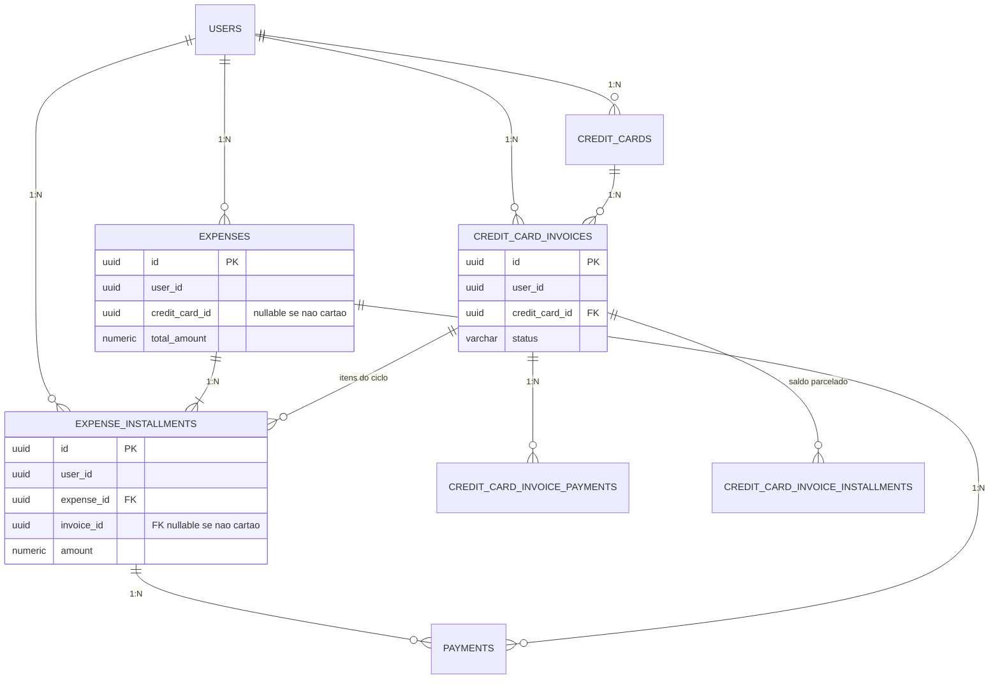
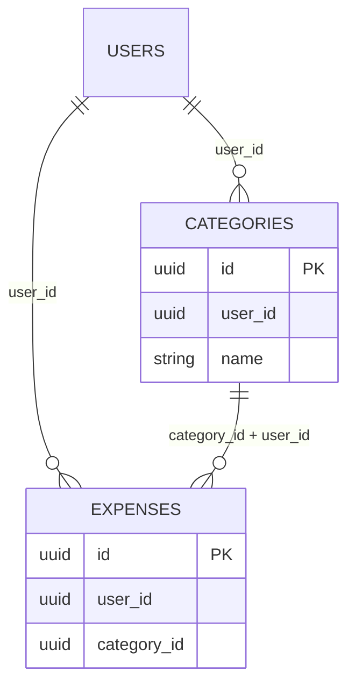

# Modelo de Dados — Financial Control

## 0. Hierarquia

`AGENTS.md` → `docs/20–28` → `docs/CODING_STANDARDS.md` → `.cursor/rules/*.mdc`

Stack e precisão: PostgreSQL 18, UUID v7 gerado pela aplicação, NUMERIC(19,2), TIMESTAMPTZ em UTC, calendário financeiro America/Sao_Paulo, BRL, coluna `active`.


## 1. Objetivo

Este documento define o modelo conceitual e lógico de dados da V1.

O modelo deve representar corretamente:

- usuários;
- contas;
- cartões;
- faturas;
- receitas;
- despesas;
- parcelas;
- pagamentos;
- transferências;
- categorias;
- metas;
- responsáveis;
- projeções.


# 2. Regra fundamental

Toda entidade financeira deve estar relacionada a um usuário.


# 3. Identificador

Todas as entidades principais devem utilizar:

UUID


# 4. UUID

Estratégia oficial: UUID v7 gerado pela aplicação.

O banco armazena o identificador como `UUID`. Não gera o valor.

Não utilizar:

AUTO_INCREMENT

SERIAL

BIGSERIAL

uuid_generate_v4()

DEFAULT gen_random_uuid()

@GeneratedValue


como estratégia de identificação.

Não misturar geração na aplicação com default de banco.


# 5. Usuário

Tabela:

users


Campos conceituais:

id

name

email

password_hash

active

created_at

updated_at


# 6. Usuário

Email deve ser único.


# 7. Usuário

Senha nunca deve ser armazenada em texto puro.


# 8. Usuário

active permite desativação da conta.


# 9. Conta financeira

Tabela:

accounts


Representa dinheiro disponível ou controlado pelo usuário.


# 10. Conta

Campos:

id

user_id

name

type

initial_balance

active

created_at

updated_at


Observação:

O saldo atual é derivado das movimentações financeiras.

Não utilizar `current_balance` como fonte independente de verdade.

Se no futuro existir saldo materializado/cacheado, ele deverá ser mantido de forma transacionalmente consistente com as movimentações.


# 11. Tipo de conta

Valores V1:

BANK_ACCOUNT

CASH


# 12. Conta

Exemplos:

Nubank

Itaú

Caixa

Carteira


# 13. Conta

A carteira de dinheiro físico será representada como uma conta do tipo:

CASH


# 14. Conta

Não criar entidade separada:

wallet


na V1.


# 15. Saldo

O sistema deve distinguir:

saldo inicial;

saldo atual;

movimentações.


# 16. Regra importante

O saldo atual não deve ser alterado arbitrariamente por operações que não representam movimentação real.


# 17. Conta

Transferências entre contas não alteram patrimônio total.


# 18. Cartão

Tabela:

credit_cards


Representa um cartão de crédito.


# 19. Cartão

Campos persistidos:

id

user_id

name

holder_name

last_four_digits

credit_limit

closing_day

due_day

active

created_at

updated_at


`credit_limit` é o limite contratado (fato persistido).

Limite disponível e comprometimento são derivados das compras/parcelas ativas do cartão. Não persistir como colunas independentes.


# 19.1 Titular

`holder_name` (holderName na API) é textual.

O titular NÃO precisa ser um usuário do sistema.

Exemplos: Felipe, Giulia, Ederson, Elisiane.


# 20. Cartão

Exemplo:

Cartão Nubank


Últimos 4:

1234


Limite:

R$ 5.000


# 21. Cartão

O cartão não é uma conta bancária.


# 22. Cartão

O limite disponível não deve ser confundido com saldo financeiro.


# 23. Categoria

Tabela:

categories


Campos:

id

user_id

name

type

active

created_at

updated_at


# 24. Categoria

Tipos:

INCOME

EXPENSE


# 25. Categoria

Exemplos de despesas:

Mercado

Moradia

Transporte

Lazer

Saúde

Educação

Assinaturas


# 26. Categoria

Exemplos de receitas:

Salário

Freelance

Outros


# 27. Categoria

Categoria pertence ao usuário.


# 28. Responsável

A V1 não precisa de tabela de responsáveis.


# 29. Responsável

Utilizar enum/controlado pelo backend.


Valores:

MINE

GIULIA

EDERSON

ELISIANE

OTHER


# 30. Responsável

Para:

OTHER


permitir texto adicional.


# 31. Responsável

Não criar cadastro separado para cada pessoa na V1.


# 32. Responsável

Estrutura conceitual:

responsible_type

responsible_name


# 33. Responsável

Para:

MINE

GIULIA

EDERSON

ELISIANE


responsible_name pode ser nulo.


# 34. Responsável

Para:

OTHER


responsible_name deve ser informado.


# 35. Receita

Tabela:

incomes


# 36. Receita

Campos:

id

user_id

category_id

account_id

description

amount

expected_date

received_date

status

responsible_type

responsible_name

notes

created_at

updated_at


`account_id` é obrigatório quando `status = RECEIVED` (RN043).

Pode ser nulo enquanto `EXPECTED` ou `CANCELLED`.

FK composta `(account_id, user_id)` é nullable.


# 37. Receita

Status V1:

EXPECTED

RECEIVED

CANCELLED


# 38. Receita

EXPECTED:

receita prevista, ainda não recebida.


# 39. Receita

RECEIVED:

dinheiro efetivamente recebido.


# 40. Receita

CANCELLED:

receita que não acontecerá.


# 41. Receita

expected_date representa a data prevista.


# 42. Receita

received_date representa a data real de recebimento.


# 43. Receita

Quando status:

EXPECTED


não deve aumentar o saldo da conta.


# 44. Receita

Quando status:

RECEIVED


deve representar entrada financeira real.


# 45. Despesa

Tabela:

expenses


# 46. Despesa

Representa uma obrigação financeira ou gasto.


# 47. Despesa

Campos conceituais:

id

user_id

category_id

account_id

credit_card_id

description

total_amount

expense_date

due_date

payment_method

status

responsible_type

responsible_name

barcode

notes

created_at

updated_at


# 48. Forma de pagamento

Valores:

ACCOUNT

CREDIT_CARD

NONE


# 49. ACCOUNT

Despesa vinculada diretamente a uma conta.


# 50. CREDIT_CARD

Despesa vinculada a cartão de crédito.


# 51. NONE

Despesa sem cartão e ainda não vinculada a uma conta para pagamento.


# 52. Despesa

Quando:

payment_method = ACCOUNT


account_id deve ser informado.


# 53. Despesa

Quando:

payment_method = CREDIT_CARD


credit_card_id deve ser informado.


# 54. Despesa

Quando:

payment_method = NONE


credit_card_id deve ser nulo.


# 55. Despesa

Uma despesa não deve possuir simultaneamente:

account_id

e

credit_card_id


como forma de pagamento principal.


# 56. Status da despesa

Valores persistidos oficiais:

OPEN

PARTIALLY_PAID

PAID

CANCELLED

REFUNDED


# 57. OPEN

Despesa ainda não paga (ou obrigação aberta).


# 58. PARTIALLY_PAID

Despesa parcialmente paga.


# 59. PAID

Despesa totalmente paga.


# 60. OVERDUE (derivado — NÃO persistir)

`OVERDUE` NÃO deve ser armazenado como status principal.

Uma despesa é considerada vencida quando:

- status é `OPEN` ou `PARTIALLY_PAID`; e
- `due_date` < data atual (timezone da aplicação).

A interface poderá apresentar "VENCIDA" sem alterar o status persistido.


# 61. REFUNDED

Despesa que ocorreu e posteriormente foi estornada.


# 62. CANCELLED

Despesa cancelada.


# 63. Despesa

Não utilizar DELETE físico como mecanismo normal de exclusão.


# 64. Histórico

Operações canceladas ou estornadas devem permanecer no banco.


# 65. Parcelamento

Tabela:

expense_installments


# 66. Parcela

Representa uma parcela individual de uma despesa.


# 67. Parcela

Campos persistidos:

id

user_id

expense_id

invoice_id

installment_number

total_installments

amount

due_date

status

created_at

updated_at


`user_id` é obrigatório (mesmo usuário da despesa).

`invoice_id` referencia `credit_card_invoices.id`.

- obrigatório quando a despesa for `CREDIT_CARD`;
- nulo quando a despesa for `ACCOUNT` ou `NONE`.

Uma despesa parcelada no cartão pode ter parcelas com `invoice_id` diferentes.

`expenses` **não** possui `invoice_id`.


# 68. Parcela

Exemplo:

Despesa:

Televisão


Total:

R$ 2.400


Parcelas:

12


Criará:

12 registros.


# 69. Parcela

Exemplo:

1/12

2/12

3/12

...

12/12


# 70. Regra

Cada parcela possui seu próprio valor.


# 71. Regra

Valores das parcelas podem ser diferentes.


# 72. Regra

A soma das parcelas deve representar o valor total da despesa, salvo operações posteriores explicitamente registradas.


# 73. Parcela

Status persistidos V1:

OPEN

PARTIALLY_PAID

PAID

CANCELLED

REFUNDED


Vencimento atrasado é derivado (mesma lógica de despesa), sem persistir OVERDUE.


# 74. Parcela

Uma parcela pode possuir valor diferente das demais.


# 75. Arredondamento

Exemplo:

R$ 100

3 parcelas


Resultado:

33,34

33,33

33,33


# 76. Regra

Nunca perder centavos no parcelamento.


# 77. Regra

A última parcela deve absorver eventual diferença de arredondamento.


# 78. Pagamento

Tabela:

payments


# 79. Pagamento

Representa dinheiro efetivamente movimentado.


# 80. Pagamento

Campos:

id

user_id

expense_id

installment_id

account_id

amount

payment_date

type

notes

created_at


`type` aparece no modelo conceitual; os valores oficiais **não** estão definidos nas regras.

PENDÊNCIA DE DECISÃO — seção 269.1. Não inventar enum, CHECK, nem migrar o campo (nem omiti-lo) até decisão explícita.


Toda despesa possui pelo menos uma parcela (seção 186 / RN063).

Portanto o pagamento referencia a parcela (`installment_id` obrigatório).

`expense_id` também é persistido para consulta, e deve ser o mesmo `expense_id` da parcela.

Integridade: o trio (user_id, expense_id, installment_id) não pode cruzar registros de outro usuário nem parcela de outra despesa.


# 81. Pagamento

Um pagamento sempre deve estar relacionado ao usuário autenticado.


# 82. Pagamento

Deve estar relacionado à conta que efetivamente realizou o pagamento.


# 83. Pagamento

Pode estar relacionado:

à despesa;

à parcela;


conforme o caso.


# 84. Pagamento

Exemplo:

Conta de luz:

R$ 200


Pagamento:

R$ 200


Conta:

Nubank


# 85. Pagamento parcial

Despesa:

R$ 500


Pagamento:

R$ 200


Saldo:

R$ 300


# 86. Segundo pagamento

Pagamento:

R$ 300


Saldo:

R$ 0


# 87. Regra

O sistema deve permitir múltiplos pagamentos para uma mesma despesa/parcela.


# 88. Regra

A soma dos pagamentos não pode ultrapassar o valor devido, salvo operação explícita de ajuste/estorno.


# 89. Estorno de pagamento

O sistema deve prever futuramente uma forma de registrar estorno de pagamento.


# 90. V1

A implementação detalhada de estornos financeiros pode ser simplificada, mas o modelo não deve impedir sua evolução.


# 91. Fatura

Tabela:

credit_card_invoices


# 92. Fatura

Representa o ciclo financeiro do cartão.


# 93. Fatura

Campos persistidos (fatos):

id

user_id

credit_card_id

reference_year

reference_month

closing_date

due_date

status

created_at

updated_at


Campos derivados (não persistidos como colunas; calculados na leitura / expostos na API):

total_amount

paid_amount

remaining_amount


Fonte de verdade e fórmulas: seções 194–199 e 263.


# 94. Fatura

Status persistidos V1:

OPEN

CLOSED

PARTIALLY_PAID

PAID


# 95. Fatura

OPEN:

ciclo atual ainda recebendo compras.


# 96. Fatura

CLOSED:

fatura fechada e aguardando pagamento.


# 97. Fatura

PARTIALLY_PAID:

parte da fatura foi paga.


# 98. Fatura

PAID:

fatura totalmente paga.


# 99. Fatura — OVERDUE (derivado)

`OVERDUE` NÃO é status persistido.

Pode ser derivado quando a fatura não está `PAID` e `due_date` < data atual.

A UI pode exibir "VENCIDA".


# 100. Regra

A fatura deve possuir:

closing_date

due_date


# 101. Regra

Uma compra no cartão deve ser associada ao ciclo correto.


# 102. Regra

A associação entre parcela e fatura deve permitir consultar:

qual fatura contém cada parcela;


e, a partir da parcela:

qual despesa originou aquele item da fatura.


Não existe `invoice_id` em `expenses`.

A despesa de cartão possui `credit_card_id`.

Cada parcela de cartão possui `invoice_id`.


# 103. Relação

credit_cards

1:N

credit_card_invoices


# 104. Relação

credit_card_invoices

1:N

expense_installments


quando a parcela pertencer a uma compra no cartão (`invoice_id` preenchido).


Não modelar:

credit_card_invoices 1:N expenses


A despesa original não pertence a uma única fatura: uma compra parcelada atravessa várias faturas (RN085).

Uma fatura contém parcelas de várias despesas (RN086).


# 105. Fatura

Não duplicar a despesa simplesmente porque uma de suas parcelas pertence a uma fatura.


# 106. Regra

A despesa continua sendo a origem do gasto.


A parcela é o item faturável.


A fatura é o agrupamento das parcelas de um ciclo do cartão.


# 107. Pagamento de fatura

O pagamento da fatura representa:

saída de dinheiro da conta bancária.


Utiliza `credit_card_invoice_payments`.

Não cria linha em `payments`.

`payments` é o pagamento de despesa/parcela com dinheiro de conta (`ACCOUNT` / `NONE`).

Compra no cartão não gera `payments` no momento da compra.


# 108. Regra

Pagamento de fatura não deve ser contabilizado novamente como nova despesa de consumo.


# 109. Exemplo

Compra:

Mercado:

R$ 500


Cartão.


Depois:

pagamento da fatura:

R$ 500


Não contabilizar:

R$ 1.000


de despesas.


# 110. Pagamento de fatura

Pode existir entidade específica:

credit_card_invoice_payments


# 111. Decisão V1

Utilizar tabela específica para pagamentos de fatura.


# 112. Tabela

credit_card_invoice_payments


# 113. Campos:

id

user_id

invoice_id

account_id

amount

payment_date

notes

created_at


# 114. Regra

Pagamento parcial permitido.


# 115. Exemplo

Fatura:

R$ 2.000


Pagamento:

R$ 1.200


Remaining:

R$ 800


# 116. Parcelamento de fatura

Tabela:

credit_card_invoice_installments


# 117. Objetivo

Representar o parcelamento do saldo de uma fatura que não foi integralmente pago.


# 118. Campos:

id

user_id

invoice_id

installment_number

total_installments

amount

due_date

status

created_at

updated_at


# 119. Regra

Parcelamento de fatura é diferente de compra parcelada.


# 120. Compra parcelada

É uma compra dividida em parcelas.


# 121. Parcelamento de fatura

É uma dívida de fatura dividida em parcelas.


# 122. Regra

Não misturar os dois conceitos.


# 123. Transferência

Tabela:

transfers


# 124. Transferência

Representa movimentação entre contas do mesmo usuário.


# 125. Campos:

id

user_id

source_account_id

destination_account_id

amount

transfer_date

description

created_at


# 126. Regra

source_account_id deve ser diferente de:

destination_account_id


# 127. Resultado

Transferência:

Nubank → Itaú


Nubank:

- R$ 500


Itaú:

+ R$ 500


# 128. Regra

Transferência não é:

receita;

despesa.


# 129. Regra

Transferência não altera patrimônio total.


# 130. Meta

Tabela:

financial_goals


# 131. Meta

Campos persistidos:

id

user_id

name

description

target_amount

target_date

status

created_at

updated_at


`current_amount` (acumulado) é derivado das contribuições. Não é coluna persistida independente. Ver seção 140.


# 132. Status

ACTIVE

COMPLETED

CANCELLED


# 133. Contribuição para meta

Tabela:

goal_contributions


# 134. Campos:

id

user_id

goal_id

account_id

amount

contribution_date

notes

created_at


# 135. Regra

Contribuição para meta representa dinheiro separado da conta.


# 136. Regra

Contribuição reduz o dinheiro disponível da conta.


# 137. Meta

A contribuição não deve ser contabilizada como despesa de consumo.


# 138. Exemplo

Conta:

R$ 5.000


Contribuição para meta:

R$ 500


Saldo disponível:

R$ 4.500


# 139. Meta

A meta possui:

target_amount (persistido)


e:

current_amount (derivado)


# 140. Regra

`current_amount` = soma de `goal_contributions.amount` da meta.

Não persistir acumulado como fonte independente (RN182, RN183, RN187).

A API pode expor `currentAmount` e o percentual de progresso, ambos calculados na leitura.

`status` (`ACTIVE`, `COMPLETED`, `CANCELLED`) continua persistido.


# 141. Auditoria

Entidades principais devem possuir:

created_at

updated_at


# 142. Integridade

Todas as tabelas financeiras devem possuir:

user_id NOT NULL


incluindo tabelas filhas:

expense_installments

credit_card_invoice_payments

credit_card_invoice_installments

goal_contributions

payments


`user_id` do filho deve ser o mesmo do pai. Garantia física: seções 264–266.


# 143. Foreign Keys

Relacionamentos devem utilizar:

FOREIGN KEY


# 144. Integridade

Não permitir referência para registro inexistente.


# 145. Exclusão

Evitar:

ON DELETE CASCADE


em entidades financeiras sem justificativa explícita.


# 146. Motivo

Excluir um usuário não deve apagar silenciosamente todo o histórico financeiro sem uma política definida.


# 147. Status

Preferir status/active para preservar histórico.


# 148. Índices

Criar índices para:

user_id


# 149. Índices

Também considerar:

expense_date

due_date

status

account_id

credit_card_id

category_id


# 150. Índices compostos

Criar índices compostos quando consultas frequentes justificarem.


# 151. Exemplo

expenses:

(user_id, due_date)


# 152. Exemplo

expenses:

(user_id, status)


# 153. Exemplo

credit_card_invoices:

(user_id, credit_card_id, reference_year, reference_month)


expense_installments:

(user_id, invoice_id)


(user_id, due_date)


# 154. Unicidade

Um cartão não deve possuir duas faturas para o mesmo ciclo.


# 155. Regra

Constraint lógica:

credit_card_id

reference_year

reference_month


devem identificar uma única fatura.


# 156. Categorias

Usuário não deve possuir duas categorias com o mesmo nome e mesmo tipo, salvo decisão futura.


# 157. Email

Email de usuário deve ser único.


# 158. Cartão

last_four_digits não precisa ser único.


# 159. Conta

Nome da conta não precisa ser único.


# 160. Despesa

Descrição não precisa ser única.


# 161. Valores

Todos os valores monetários devem utilizar:

NUMERIC


no PostgreSQL.


# 162. Precisão

Valores monetários da V1 utilizam:

NUMERIC(19,2)

Não utilizar NUMERIC(19,4) para dinheiro.

Não utilizar FLOAT, REAL ou DOUBLE PRECISION para valores financeiros.

Percentuais são armazenados como fração:

5,25% = 0.0525

Assim: 100.00 × 0.0525 = 5.25


# 163. Não utilizar

REAL


# 164. Não utilizar

DOUBLE PRECISION


para valores financeiros.


# 165. Datas

Datas financeiras sem horário:

DATE


# 166. Timestamps

Eventos de sistema:

TIMESTAMP WITH TIME ZONE


quando representarem instante real.


# 167. Timezone

Persistência de timestamps: UTC (`TIMESTAMPTZ` / `Instant`).

Calendário financeiro: `America/Sao_Paulo` ("hoje", vencimento, fechamento, atraso, ciclos).

O frontend não deve usar o timezone do navegador para regras financeiras.


# 168. Brasil

O sistema inicialmente será utilizado no Brasil.


# 169. Moeda

V1:

BRL


# 170. Regra

Não implementar múltiplas moedas na V1.


# 171. Futuro

O modelo não deve impedir suporte futuro a outras moedas.


# 172. Boleto

Despesas podem possuir:

barcode


# 173. Boleto

barcode é opcional.


# 174. Boleto

Deve permitir armazenar o número utilizado para pagamento.


# 175. Regra

Não armazenar imagem do boleto na V1.


# 176. Fatura

Não armazenar PDF da fatura na V1.


# 177. Relatório

O relatório deve ser gerado a partir dos dados do banco.


# 178. Relatório

Não criar uma tabela duplicando todas as informações da fatura apenas para gerar relatório.


# 179. Histórico

Operações financeiras devem permanecer rastreáveis.


# 180. Regra

Alterações importantes não devem apagar informações históricas sem necessidade.


# 181. Auditoria futura

O sistema poderá futuramente possuir:

audit_logs


# 182. V1

Não é obrigatório implementar audit_logs agora.


# 183. Relacionamentos principais

users

1:N

accounts


users

1:N

credit_cards


users

1:N

categories


users

1:N

incomes


users

1:N

expenses


users

1:N

transfers


users

1:N

financial_goals


credit_cards

1:N

credit_card_invoices


expenses

1:N

expense_installments


expenses

1:N

payments


expense_installments

1:N

payments


accounts

1:N

payments


credit_card_invoices

1:N

expense_installments


credit_card_invoices

1:N

credit_card_invoice_payments


credit_card_invoices

1:N

credit_card_invoice_installments


financial_goals

1:N

goal_contributions


# 184. Despesa parcelada

Uma expense pode possuir:

1 ou mais installments.


# 185. Despesa não parcelada

Mesmo uma despesa à vista pode possuir uma única parcela, caso essa seja a estratégia adotada pela implementação.


# 186. Decisão

A implementação deve preferir um modelo consistente:

toda despesa possui pelo menos uma parcela.


# 187. Motivo

Isso simplifica:

- vencimentos;
- pagamentos;
- relatórios;
- projeções;
- despesas parceladas.


# 188. Despesa

total_amount representa o valor total originalmente registrado.


# 189. Parcela

amount representa o valor daquela parcela.


# 190. Pagamento

amount representa o valor efetivamente pago.


# 191. Regra

Não confundir:

expense.total_amount

installment.amount

payment.amount


# 192. Exemplo

Despesa:

R$ 1.000


Parcelas:

5


Cada parcela:

R$ 200


Pagamento:

R$ 200


# 193. Resultado

Despesa:

R$ 1.000


Parcela:

R$ 200


Pagamento:

R$ 200


# 194. Fatura — total_amount (derivado)

`total_amount` NÃO é coluna persistida.

É a soma das parcelas (`expense_installments.amount`) vinculadas à fatura (`invoice_id`), excluindo parcelas `CANCELLED` e `REFUNDED`.

Não somar a despesa inteira (`expenses.total_amount`): uma despesa parcelada atravessa várias faturas.


# 195. Regra

Evitar múltiplas fontes de verdade para o mesmo valor.

Fatos persistidos da fatura:

- parcelas vinculadas (`expense_installments.invoice_id`);
- pagamentos realizados (`credit_card_invoice_payments`).

Valores derivados:

- `total_amount`
- `paid_amount`
- `remaining_amount`


# 196. Fatura — paid_amount (derivado)

`paid_amount` NÃO é coluna persistida.

É a soma de `credit_card_invoice_payments.amount` da fatura.


# 197. Fatura — remaining_amount (derivado)

`remaining_amount` NÃO é coluna persistida.

Fórmula:

remaining_amount = total_amount − paid_amount


# 198. Decisão V1

Não persistir `total_amount`, `paid_amount` nem `remaining_amount` em `credit_card_invoices`.

A API pode (e deve) expô-los no response, calculados na leitura.

O `status` da fatura (`OPEN`, `CLOSED`, `PARTIALLY_PAID`, `PAID`) continua persistido: é ciclo/estado, não valor monetário.


# 199. Parcelamento do saldo restante

`credit_card_invoice_installments` representa o plano de parcelamento do saldo restante.

Criar esse parcelamento **não** altera `total_amount` nem `paid_amount`.

O saldo restante só diminui quando houver pagamento em `credit_card_invoice_payments`.

Esse parcelamento é distinto das parcelas de compra (`expense_installments`) — RN110.


# 200. Projeções

Projeções não devem possuir tabela específica inicialmente.


# 201. Projeções

Devem ser calculadas a partir de:

receitas esperadas;

despesas abertas;

parcelas futuras;

faturas;

parcelamentos.


# 202. Regra

Não duplicar dados apenas para gerar projeção.


# 203. Saldo

A fonte de verdade financeira deve ser baseada nas **movimentações**.


# 204. Implementação

O sistema deve possuir estrutura consistente de movimentações financeiras.

O saldo é derivado dessas movimentações (a partir de `initial_balance` + entradas − saídas).


# 205. Regra

Não utilizar somente um campo `current_balance` como fonte independente de verdade.


# 206. Cache / materialização

Caso futuramente exista saldo materializado/cacheado para performance, ele deverá ser derivado e mantido de forma transacionalmente consistente com as movimentações.


# 207. Decisão V1

Utilizar:

- `initial_balance`
- movimentações como fonte de verdade
- saldo calculado/derivado (e, se houver cache, sempre consistente com as movimentações)


# 208. Regra

A implementação não deve permitir divergência entre saldo apresentado e movimentações.


# 209. Conta

Movimentações reais incluem:

recebimentos;

pagamentos;

transferências.


# 210. Cartão

Movimentações de cartão incluem:

compras;

estornos;

cancelamentos.


# 211. Regra

Compra no cartão não reduz saldo bancário no momento da compra.


# 212. Regra

Pagamento da fatura reduz saldo bancário.


# 213. Regra

Compra no cartão aumenta o comprometimento do cartão.


# 213.1 Limite disponível

Uma compra não pode ultrapassar o limite disponível do cartão.

Exemplo:

Limite R$ 5.000,00; comprometido R$ 4.500,00; disponível R$ 500,00; compra R$ 600,00 → recusada.

Validação obrigatória no backend.


# 214. Regra

Estorno deve reduzir o comprometimento correspondente.


# 215. Responsável

O responsável deve ser armazenado na despesa e/ou receita quando aplicável.


# 216. Relatório

Relatórios devem conseguir agrupar por:

responsável;

categoria;

cartão;

conta;

período.


# 217. Privacidade

Nenhum usuário deve conseguir consultar dados de outro usuário.


# 218. Regra crítica

Toda consulta financeira deve ser filtrada por:

authenticated_user_id


# 219. Regra crítica

Não confiar no:

user_id


recebido pelo frontend.


# 220. Integridade

Todas as operações financeiras críticas devem ocorrer dentro de transação.


# 221. Integridade

Não permitir:

pagamento > valor devido.


# 222. Integridade

Não permitir:

transferência > saldo disponível.


# 223. Decisão

A V1 deve impedir saldo negativo em operações financeiras normais:

- transferências;
- pagamento de despesas;
- pagamento de fatura (valor não pode exceder o saldo disponível da conta).


# 224. Observação

Saldo negativo poderá ser suportado futuramente através de configuração específica e decisão explícita.


# 225. Integridade

Não permitir parcelamento com:

quantidade <= 0.


# 226. Integridade

Não permitir valor:

<= 0


para operações financeiras normais.


# 227. Exceção

Estornos podem possuir lógica específica.


# 228. Integridade

Não permitir cartão com:

closing_day inválido.


# 229. Integridade

closing_day:

1 até 31


# 230. Integridade

due_day:

1 até 31


# 231. Observação

Alguns meses possuem menos dias.


# 232. Regra (RN098)

Se o mês não possuir o dia configurado de fechamento ou vencimento, utilizar o último dia daquele mês.


# 233. Exemplo

Vencimento configurado:

31


Abril (30 dias):

30/04


Fevereiro não bissexto:

28/02


# 234. Regra

A regra deve ser documentada na implementação da geração de faturas.


# 235. Fatura

A criação da fatura pode ser automática quando uma compra for registrada.


# 236. Regra

Não exigir que o usuário crie manualmente uma fatura antes de cadastrar uma compra.


# 237. Backend

Ao criar compra no cartão:

1. identificar ciclo;
2. localizar/criar fatura;
3. criar despesa;
4. criar parcelas;
5. vincular parcelas à fatura correta;
6. confirmar transação.


# 238. Compra parcelada

Cada parcela pode cair em uma fatura diferente.


# 239. Exemplo

Compra:

05/08


12x


Cartão fecha:

10/08


Parcela 1:

fatura agosto


Parcela 2:

fatura setembro


etc.


# 240. Regra

A parcela de cartão deve possuir referência à fatura correspondente (`invoice_id` obrigatório).

Parcela de despesa `ACCOUNT` ou `NONE` não possui fatura (`invoice_id` nulo).


# 241. Modelo

expense_installments possui:

invoice_id


nullable conforme a forma de pagamento da despesa. Ver seção 67.


# 242. Motivo

Uma compra parcelada pode gerar parcelas em múltiplas faturas (RN085).


# 243. Regra

A despesa original possui:

credit_card_id


e cada parcela de cartão possui:

invoice_id


`expenses` não possui `invoice_id`.


# 244. Resultado

É possível consultar:

qual compra originou a parcela;


e:

em qual fatura a parcela está.


# 245. Compra no cartão

A despesa deve ter:

credit_card_id


# 246. Parcela de cartão

A parcela deve ter:

invoice_id


# 247. Regra

Não assumir que todas as parcelas de uma despesa pertencem à mesma fatura.


# 248. Relatório

Relatório de fatura deve utilizar:

invoice

→ expense_installments (invoice_id)

→ expense


# 249. Resultado

É possível mostrar:

descrição;

categoria;

responsável;

parcela;

valor;

data.


# 250. Modelo final conceitual

USER

├── ACCOUNTS

├── CREDIT_CARDS
│   └── CREDIT_CARD_INVOICES
│       ├── EXPENSE_INSTALLMENTS (itens do ciclo; invoice_id)
│       ├── CREDIT_CARD_INVOICE_PAYMENTS
│       └── CREDIT_CARD_INVOICE_INSTALLMENTS (parcelamento do saldo restante)
│
├── CATEGORIES
│
├── INCOMES
│
├── EXPENSES
│   └── EXPENSE_INSTALLMENTS
│       └── PAYMENTS
│
├── TRANSFERS
│
└── FINANCIAL_GOALS
    └── GOAL_CONTRIBUTIONS


A mesma `expense_installments` aparece sob `EXPENSES` (origem) e sob `CREDIT_CARD_INVOICES` (ciclo), via `invoice_id`.

Não há ligação direta expense → invoice.


# 251. Regra final

O banco deve representar fatos financeiros reais.


# 252. Regra final

Não criar tabelas apenas para satisfazer uma tela.


# 253. Regra final

Não duplicar informação sem necessidade.


# 254. Regra final

Toda regra financeira importante deve ser implementada no backend.


# 255. Regra final

O modelo deve priorizar:

consistência;

integridade;

rastreabilidade;

evolução.


# 256. Critério de aceitação

Antes de implementar o banco:

- revisar relacionamentos;
- revisar status;
- revisar valores monetários;
- revisar pagamentos;
- revisar faturas;
- revisar parcelamentos;
- revisar transferências;
- revisar isolamento por usuário.


# 257. Critério de aceitação

A migration inicial somente deve ser criada depois que este modelo estiver validado.


# 258. Regra final

Se uma decisão do modelo não estiver clara:

parar a implementação;

explicar o problema;

apresentar alternativas;

aguardar decisão.


# 259. Regra final

Não inventar regras financeiras.


# 260. Regra final

Em caso de dúvida sobre comportamento financeiro:

consultar os documentos:

20-fluxos-financeiros.md

e:

23-modelo-de-dados.md


antes de implementar.


# 261. Decisão consolidada — despesa, parcela e fatura

Relacionamento oficial (RN085, RN086):

```text
credit_card
    ↓ 1:N
credit_card_invoice
    ↑ N:1
expense_installment
    ↑ N:1
expense
```

Ou, no sentido da criação da compra:

```text
expense
    ↓ 1:N
expense_installment
    ↓ N:1 (invoice_id; só cartão)
credit_card_invoice
```

Regras:

- `expenses` é a compra/despesa original;
- `expenses.credit_card_id` é obrigatório quando `payment_method = CREDIT_CARD`;
- `expense_installments` são as parcelas;
- cada parcela de cartão pertence a **uma** fatura;
- parcelas da mesma despesa podem pertencer a **faturas diferentes**;
- `invoice_id` está em `expense_installments`, **nunca** em `expenses`;
- `GET /invoices/{id}/items` retorna parcelas, não despesas inteiras.

Exemplo: compra de R$ 2.400 em 12x

```text
expense (R$ 2.400, credit_card_id)
  ├── installment 1  → fatura agosto
  ├── installment 2  → fatura setembro
  ├── installment 3  → fatura outubro
  └── ...
```


# 262. Diagrama — cartão, fatura e parcela



Não existe FK `expenses.invoice_id`.


# 263. Decisão consolidada — valores da fatura

Decisão V1, alinhada a RN182, RN183 e RN184:

| Conceito | Persistido? | Fonte de verdade |
|---|---|---|
| parcelas do ciclo | sim — `expense_installments` | fato |
| pagamentos da fatura | sim — `credit_card_invoice_payments` | fato |
| status da fatura | sim — `credit_card_invoices.status` | ciclo/estado |
| datas de fechamento/vencimento | sim | fato |
| `total_amount` | **não** | derivado |
| `paid_amount` | **não** | derivado |
| `remaining_amount` | **não** | derivado |

Fórmulas:

```text
total_amount =
    SUM(expense_installments.amount)
    WHERE invoice_id = :invoiceId
      AND status NOT IN ('CANCELLED', 'REFUNDED')

paid_amount =
    SUM(credit_card_invoice_payments.amount)
    WHERE invoice_id = :invoiceId

remaining_amount = total_amount - paid_amount
```

Não somar `expenses.total_amount` para obter o total da fatura.

Não persistir esses três valores. Se no futuro forem materializados por performance, deixam de ser fonte de verdade: devem ser cache transacionalmente consistente com as fórmulas acima (mesmo princípio do saldo da conta).

O backend usa os valores derivados para:

- validar que o pagamento não ultrapassa o devido (RN185);
- transitar o status para `PARTIALLY_PAID` ou `PAID`.

A API expõe `totalAmount`, `paidAmount` e `remainingAmount` no response (docs/25). Isso não os torna colunas.


# 264. Decisão consolidada — isolamento de ownership

FK simples `expense.category_id → categories.id` garante apenas que a categoria existe.

Não garante que a categoria pertence ao mesmo usuário da despesa.

A V1 exige as duas camadas:

1. aplicação — `user_id` sempre do contexto autenticado; nunca do cliente (RN001, RN002, RN188);
2. banco — impossível persistir referência cruzada entre usuários.

Mecanismo físico:

- toda tabela financeira tem `user_id UUID NOT NULL`;
- toda tabela referenciada por ownership possui `UNIQUE (id, user_id)` além da PK `id`;
- FKs de ownership são compostas: `(referenced_id, user_id) → parent (id, user_id)`.

O `user_id` do filho é o mesmo valor do pai. Não existe “usuário da despesa” diferente do “usuário da categoria”.


# 265. FKs compostas — especificação

PK de todas as entidades principais permanece:

```text
id UUID PRIMARY KEY
```

(UUID v7 gerado pela aplicação.)

Para cada tabela pai referenciada com ownership, além da PK:

```text
UNIQUE (id, user_id)
```

Esse UNIQUE existe para ser alvo da FK composta. Não substitui a PK.

FKs compostas obrigatórias:

| Tabela filha | FK composta | Pai |
|---|---|---|
| accounts | — (só `user_id → users`) | users |
| categories | — | users |
| credit_cards | — | users |
| incomes | `(category_id, user_id)` | categories |
| incomes | `(account_id, user_id)` | accounts (nullable) |
| expenses | `(category_id, user_id)` | categories |
| expenses | `(account_id, user_id)` | accounts (nullable) |
| expenses | `(credit_card_id, user_id)` | credit_cards (nullable) |
| expense_installments | `(expense_id, user_id)` | expenses |
| expense_installments | `(invoice_id, user_id)` | credit_card_invoices (nullable) |
| payments | `(expense_id, user_id)` | expenses |
| payments | `(installment_id, user_id)` | expense_installments |
| payments | `(account_id, user_id)` | accounts |
| credit_card_invoices | `(credit_card_id, user_id)` | credit_cards |
| credit_card_invoice_payments | `(invoice_id, user_id)` | credit_card_invoices |
| credit_card_invoice_payments | `(account_id, user_id)` | accounts |
| credit_card_invoice_installments | `(invoice_id, user_id)` | credit_card_invoices |
| transfers | `(source_account_id, user_id)` | accounts |
| transfers | `(destination_account_id, user_id)` | accounts |
| financial_goals | — | users |
| goal_contributions | `(goal_id, user_id)` | financial_goals |
| goal_contributions | `(account_id, user_id)` | accounts |

Todas as tabelas acima (exceto `users`) também referenciam `users(id)` via `user_id`.

FK composta nullable: `MATCH SIMPLE` do PostgreSQL (padrão). Se `invoice_id` é NULL, a FK composta não é exigida. Correto para parcelas `ACCOUNT`/`NONE`.

Integridade adicional de pagamento (não é ownership, é consistência interna):

```text
payments (installment_id, expense_id)
    → expense_installments (id, expense_id)
```

Requer `UNIQUE (id, expense_id)` em `expense_installments`.

Impede pagamento vinculado a parcela de outra despesa.

Cross-check de cartão (aplicação, mesma transação):

`expense.credit_card_id` da parcela deve ser igual a `credit_card_invoices.credit_card_id` da fatura apontada por `invoice_id`.

Não denormalizar `credit_card_id` em `expense_installments` na V1 só para essa checagem.


# 266. Compatibilidade JPA / Spring Data

Objetivo: o banco impede cruzamento; o JPA permanece simples.

Mapeamento JPA da V1:

- PK: `id`;
- `userId` como coluna simples, preenchida pelo Service a partir do contexto de segurança;
- associações `@ManyToOne` / `@JoinColumn` apenas no id (`category_id`, `account_id`, …);
- **não** mapear `@JoinColumns` compostas envolvendo `user_id` (evita o Hibernate gravar `user_id` duas vezes).

As FKs compostas vivem no Flyway. São integridade de schema, não mapeamento JPA.

`ddl-auto=validate` verifica colunas e FKs simples mapeadas. Constraints extras do Flyway são válidas e esperadas.

Repositórios continuam filtrando por `userId` do contexto (defesa em profundidade). A FK composta não substitui o filtro nas queries; impede persistência inconsistente mesmo se uma query falhar.

Não usar `ON DELETE CASCADE` nessas FKs.


# 267. Diagrama — ownership



Inválido e rejeitado pelo banco:

```text
expense.user_id = A
expense.category_id = categoria do usuário B
```


# 268. Critério de aceitação desta consolidação

Antes da primeira migration:

- `invoice_id` somente em `expense_installments`;
- `credit_card_invoices` sem colunas `total_amount`, `paid_amount`, `remaining_amount`;
- `financial_goals` sem coluna independente `current_amount`;
- `expense_installments.user_id` obrigatório;
- FKs compostas `(id, user_id)` documentadas nesta seção e a criar no Flyway da Fase 2.


# 269. PENDÊNCIA DE DECISÃO — bloqueio oficial

Governança: `AGENTS.md` seção 28.

Nenhuma lacuna abaixo pode ser preenchida por suposição técnica.

Não criar migration, coluna, enum, CHECK, constante, validação, teste ou regra de Service/API dependente destes itens até decisão explícita.

Não sugerir “criar a coluna sem CHECK por enquanto” nem “omitir o campo na migration”: ambas são hipóteses.

O restante do modelo consolidado (seções 261–268) permanece fonte de verdade.


## 269.1 `payments.type`

O campo aparece no modelo conceitual. `docs/20–28` **não** definem valores oficiais.

Não implementar até responder:

1. O campo `type` deve permanecer?
2. Quais são os valores oficiais?
3. Será enum lógico/aplicacional, CHECK no banco, ambos, ou nenhum?
4. Existe significado adicional associado a cada valor?

Até lá: não criar enum, CHECK, constantes, validações nem regras baseadas nesse campo.

A tabela `payments` (demais colunas já definidas) não deve ser migrada com `type` hipotético nem com a omissão silenciosa do campo.


## 269.2 Edição de parcela futura × `expenses.total_amount`

RN067 vale **na criação** do parcelamento. O fluxo de edição de parcela futura (`docs/20`) não define o efeito sobre o total.

Não decidir sozinho entre: alterar `expenses.total_amount`; redistribuir; manter o total original; rejeitar; permitir divergência; recalcular demais parcelas.

Não implementar a edição até responder:

1. Se uma parcela futura for alterada, `expenses.total_amount` deve mudar?
2. A soma das parcelas deve obrigatoriamente continuar igual ao total da despesa?
3. A diferença deve ser redistribuída entre outras parcelas?
4. Se redistribuída, qual regra?
5. É permitido que a soma das parcelas fique diferente de `expenses.total_amount`?
6. Quais parcelas podem ser alteradas?
7. O comportamento muda quando uma ou mais parcelas já estão vinculadas a faturas?

A tabela `expense_installments` em si (criação, FKs, `invoice_id`) já está definida. O bloqueio é da **regra de edição**, não do schema da parcela.


## 269.3 Pagamento parcial da fatura × status das parcelas

Pagamentos da fatura: `credit_card_invoice_payments`.

Não há regra oficial de rateio nem de efeito sobre `expense_installments.status`.

Não assumir: FIFO, LIFO, proporcional, quitação das menores, manter todas `OPEN`, status individual, ou outra estratégia.

Não implementar o efeito do pagamento parcial sobre parcelas até responder:

1. O pagamento parcial altera o status das parcelas?
2. Se sim, qual regra de rateio?
3. O rateio é FIFO, proporcional ou outro?
4. Uma parcela pode ficar parcialmente paga?
5. Existe valor pago individualmente por parcela?
6. As parcelas permanecem `OPEN` enquanto a fatura não estiver `PAID`?
7. O status da fatura é independente do status das parcelas?
8. O pagamento parcial deve aparecer na API como valor da fatura apenas ou também como valor por parcela?

Não criar coluna de “valor pago da parcela via fatura” para antecipar a resposta da pergunta 5.

Totais da fatura continuam **derivados** (seção 263). Status da fatura continua persistido.