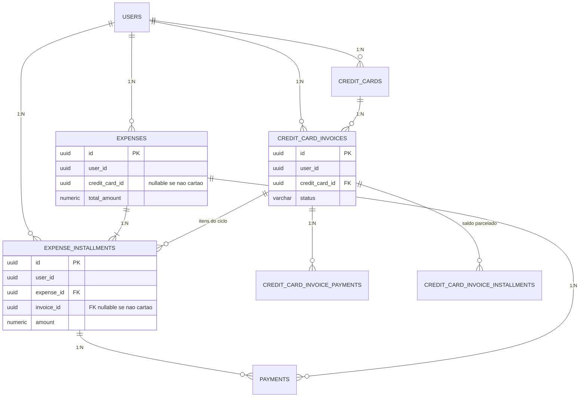
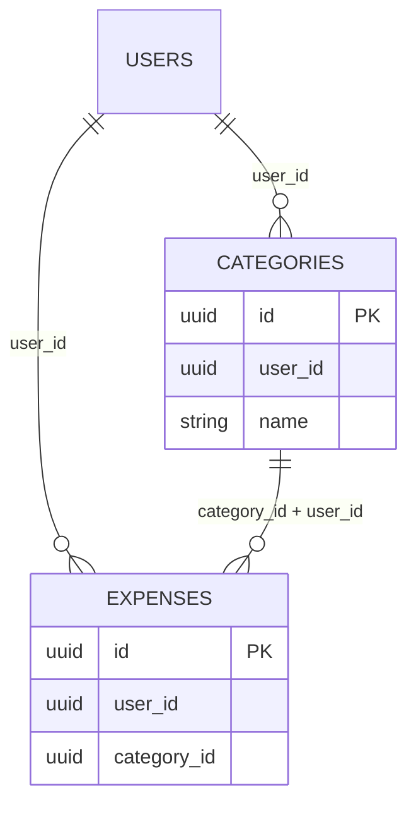

# Modelo de Dados — Financial Control

## 0. Hierarquia

`AGENTS.md` → `docs/20–28` → `docs/CODING_STANDARDS.md` → `.cursor/rules/*.mdc`

Stack e precisão: PostgreSQL 18, UUID v7 gerado pela aplicação, NUMERIC(19,2), TIMESTAMPTZ em UTC, calendário financeiro America/Sao_Paulo, BRL, coluna `active`.


## 1. Objetivo

Este documento define o modelo conceitual e lógico de dados da V1.

O modelo deve representar corretamente:

- usuários;
- contas;
- cartões;
- faturas;
- receitas;
- despesas;
- parcelas;
- pagamentos;
- transferências;
- categorias;
- metas;
- responsáveis;
- projeções.


# 2. Regra fundamental

Toda entidade financeira deve estar relacionada a um usuário.


# 3. Identificador

Todas as entidades principais devem utilizar:

UUID


# 4. UUID

Estratégia oficial: UUID v7 gerado pela aplicação.

O banco armazena o identificador como `UUID`. Não gera o valor.

Não utilizar:

AUTO_INCREMENT

SERIAL

BIGSERIAL

uuid_generate_v4()

DEFAULT gen_random_uuid()

@GeneratedValue


como estratégia de identificação.

Não misturar geração na aplicação com default de banco.


# 5. Usuário

Tabela:

users


Campos conceituais:

id

name

email

password_hash

active

created_at

updated_at


# 6. Usuário

Email deve ser único.


# 7. Usuário

Senha nunca deve ser armazenada em texto puro.


# 8. Usuário

active permite desativação da conta.


# 9. Conta financeira

Tabela:

accounts


Representa dinheiro disponível ou controlado pelo usuário.


# 10. Conta

Campos:

id

user_id

name

type

initial_balance

initial_balance_locked

active

created_at

updated_at


Observação:

O saldo atual é derivado das movimentações financeiras.

Não utilizar `current_balance` como fonte independente de verdade.

Se no futuro existir saldo materializado/cacheado, ele deverá ser mantido de forma transacionalmente consistente com as movimentações.

`initial_balance` é ponto de partida da linha temporal (RN010 / RN010A / Fase 14). Começa conceitualmente em `0,00`. Em `POST /accounts`, `initialBalance` é **opcional** (omitido ⇒ `0,00`). Definição/alteração posterior somente via `PUT /api/v1/accounts/{id}/initial-balance`, enquanto a conta **nunca** tiver tido movimentação financeira efetiva (RN010A). Após a primeira movimentação (mesmo que depois cancelada/revertida), correções usam **Acerto de Saldos** (`BALANCE_ADJUSTMENT` / tabela `account_balance_adjustments`), não edição de `initial_balance`.

`initial_balance_locked` foi adicionado pela migration V28 e registra de forma persistente o encerramento da mutabilidade do saldo inicial após a primeira movimentação efetiva, conforme RN010A. Reverse/cancelamento posterior **não** desbloqueia. **Limitação histórica inevitável:** incomes totalmente revertidos **antes** da V28 podem ser indetectáveis no backfill (contrato da Fase 6 remove `account_id` / `received_date`). Isso não é bug da Fase 14.


# 11. Tipo de conta

Valores V1:

BANK_ACCOUNT

CASH


# 12. Conta

Exemplos:

Nubank

Itaú

Caixa

Carteira


# 13. Conta

A carteira de dinheiro físico será representada como uma conta do tipo:

CASH


# 14. Conta

Não criar entidade separada:

wallet


na V1.


# 15. Saldo

O sistema deve distinguir:

saldo inicial;

saldo atual;

movimentações.


# 16. Regra importante

O saldo atual não deve ser alterado arbitrariamente por operações que não representam movimentação real.

**Acerto de Saldos** (`BALANCE_ADJUSTMENT`), implementado na Fase 14, é fato real de conciliação — não edição direta de um campo de saldo corrente. Persistência do fato: `calculated_balance`, `reported_balance`, `adjustment_amount` (não são `current_balance` da conta). Tabela oficial: `account_balance_adjustments`.


# 17. Conta

Transferências entre contas `BANK_ACCOUNT` do mesmo usuário não alteram patrimônio total. `CASH` não participa de transferências (Fase 14).


# 18. Cartão

Tabela:

credit_cards


Representa um cartão de crédito.


# 19. Cartão

Campos persistidos:

id

user_id

name

holder_name

last_four_digits (opcional; **não** obrigatório)

credit_limit

closing_day

due_day

active

created_at

updated_at


`credit_limit` é o limite contratado (fato persistido).

`used_limit` e `available_limit` são derivados das compras/parcelas ainda não liquidadas. Não persistir como colunas.

Não armazenar PAN, CVC, senha nem validade do plástico.


# 19.1 Titular

`holder_name` (holderName na API) é textual e filtrável.

O titular NÃO precisa ser o usuário autenticado.

Exemplos: Felipe, Giulia, Ederson, Elisiane.


# 20. Cartão

Exemplo:

Cartão Nubank


Últimos 4:

1234


Limite:

R$ 5.000


# 21. Cartão

O cartão não é uma conta bancária.


# 22. Cartão

O limite disponível não deve ser confundido com saldo financeiro.


# 23. Categoria

Tabela:

categories


Campos:

id

user_id

name

type

active

created_at

updated_at


# 24. Categoria

Tipos:

INCOME

EXPENSE


# 25. Categoria

Exemplos de despesas:

Mercado

Moradia

Transporte

Lazer

Saúde

Educação

Assinaturas


# 26. Categoria

Exemplos de receitas:

Salário

Freelance

Outros


# 27. Categoria

Categoria pertence ao usuário.


# 28. Responsável

A V1 não precisa de tabela de responsáveis.


# 29. Responsável

Utilizar enum/controlado pelo backend.


Valores:

MINE

GIULIA

EDERSON

ELISIANE

OTHER


# 30. Responsável

Para:

OTHER


permitir texto adicional.


# 31. Responsável

Não criar cadastro separado para cada pessoa na V1.


# 32. Responsável

Estrutura conceitual:

responsible_type

responsible_name


# 33. Responsável

Para:

MINE

GIULIA

EDERSON

ELISIANE


responsible_name pode ser nulo.


# 34. Responsável

Para:

OTHER


responsible_name deve ser informado.


# 35. Receita

Tabela:

incomes

O registro nesta tabela é a duplicata (título a receber). Não existe tabela separada.


# 36. Receita

Campos:

id

user_id

category_id

account_id

description

amount

expected_date

received_date

status

responsible_type

responsible_name

notes

created_at

updated_at


`account_id` é obrigatório quando `status = RECEIVED` (RN043).

Em `EXPECTED`, `account_id` e `received_date` são nulos. Em `RECEIVED`, ambos são obrigatórios.

`CANCELLED` inutiliza a duplicata; não representa recebimento efetivo. Nesta fase o cancelamento parte somente de `EXPECTED`. Após estorno (`RECEIVED` → `EXPECTED`), `account_id` e `received_date` voltam a nulos; a duplicata permanece ativa.

Não criar CHECK adicional nesta etapa. A Fase 6 deve respeitar o contrato.

FK composta `(account_id, user_id)` é nullable.

`responsible_type` e `responsible_name` permanecem no modelo físico. A Fase 6 **não** os utiliza na API, nas regras de negócio nem nos testes (RN203). Não remover as colunas.

`responsible_type` é nullable (migration V16). Não persistir valor artificial para preencher a coluna. O CHECK de valores (`MINE`, `GIULIA`, `EDERSON`, `ELISIANE`, `OTHER`) permanece inalterado. `responsible_name` permanece e aceita ausência de responsável.


# 37. Receita

Status V1:

EXPECTED

RECEIVED

CANCELLED


# 38. Receita

EXPECTED:

duplicata ativa, receita prevista, ainda não recebida.

É também o estado após o estorno de um recebimento: a duplicata permanece ativa e pode ser recebida novamente.


# 39. Receita

RECEIVED:

dinheiro efetivamente recebido.

O recebimento baixa a duplicata (`EXPECTED` → `RECEIVED`) e gera a movimentação financeira.


# 40. Receita

CANCELLED:

o cancelamento inutiliza a duplicata.

A receita não acontecerá. O registro permanece para histórico. Não é mais pendente. Não pode ser recebida nesta fase.

Não participa do saldo efetivo nem da projeção.

Não é o resultado de um estorno de recebimento.


# 40.1 Transições de status de receita

Cancelamento e estorno **não são a mesma operação**.

O registro em `incomes` é a duplicata (título a receber). Não existe entidade separada.

Ciclo oficial:

```text
CRIAR RECEITA
      ↓
   EXPECTED
    ↙     ↘
RECEBER   CANCELAR
   ↓          ↓
RECEIVED   CANCELLED
   ↓
ESTORNAR
   ↓
EXPECTED
```

Permitidas:

```text
EXPECTED
   ├── receive ──► RECEIVED
   └── cancel  ──► CANCELLED

RECEIVED
   └── reverse ──► EXPECTED
```

Cancelar inutiliza a duplicata. Estornar desfaz o recebimento e mantém a duplicata ativa como não recebida.

Não existe status `REVERSED`. Os status oficiais continuam `EXPECTED`, `RECEIVED` e `CANCELLED`.

Não permitidas nesta fase: `RECEIVED` → `CANCELLED`; `CANCELLED` → `EXPECTED`; `CANCELLED` → `RECEIVED`; `receive` sobre receita já `RECEIVED`; `reverse` sobre `EXPECTED` ou `CANCELLED`. Não há reativação de receita cancelada nesta fase.

O caminho composto `RECEIVED` → reverse → `EXPECTED` → cancel → `CANCELLED` já é possível pela composição das operações definidas.

**DECISÃO PENDENTE DO DESENVOLVEDOR:** cancelamento direto de receita já `RECEIVED`. A Fase 6 rejeita essa transição. Não está definido se, em fase posterior, ela existirá. Não implementar até decisão explícita.


# 40.2 Estorno de receita

O estorno é operação explícita sobre receita `RECEIVED`. **Não cancela** a duplicata.

Desfaz o impacto financeiro do recebimento original na conta que recebeu o valor.

Altera o status para `EXPECTED` (duplicata ativa, não recebida). Não altera para `CANCELLED`.

Limpa `account_id` e `received_date` (`null`).

A duplicata continua existindo, permanece ativa e pode ser recebida novamente.

Não cria despesa, receita negativa, `REFUNDED`, `REVERSED` nem `CANCELLED`.

Não é bloqueado se o saldo resultante for negativo. Esta possibilidade de saldo negativo é exceção à regra das operações normais.

Operação atômica: se qualquer etapa falhar, rollback completo.

O próximo `POST /receive` informa novamente `accountId` e `receivedDate`.

Receita `RECEIVED` não deve ser editada de forma que altere silenciosamente a movimentação já realizada. Correção: estornar → editar em `EXPECTED` → receber novamente.


# 40.3 Contrato de campos por status

```text
EXPECTED
  account_id = NULL
  received_date = NULL

RECEIVED
  account_id != NULL
  received_date != NULL

CANCELLED
  inutiliza a duplicata
  não representa recebimento efetivo
  nesta fase parte somente de EXPECTED
  (account_id e received_date já nulos)
```

Ciclo de recebimento e estorno:

```text
EXPECTED
account_id = NULL
received_date = NULL
        ↓ RECEIVE
RECEIVED
account_id = conta informada
received_date = data informada
        ↓ REVERSE
EXPECTED
account_id = NULL
received_date = NULL
```

Ciclo de cancelamento (não é estorno):

```text
EXPECTED
account_id = NULL
received_date = NULL
        ↓ CANCEL
CANCELLED
duplicata inutilizada
sem movimentação financeira
```


# 40.4 Cancelamento de receita

O cancelamento (`EXPECTED` → `CANCELLED`) inutiliza a duplicata.

Não desfaz recebimento. Não limpa `account_id` / `received_date` por analogia com o estorno: em `EXPECTED` esses campos já são nulos.

Não há efeito financeiro a reverter.

Ver RN045 e RN207.


# 41. Receita

expected_date representa a data prevista.


# 42. Receita

received_date representa a data real de recebimento.


# 43. Receita

Quando status:

EXPECTED


não deve aumentar o saldo da conta.


# 44. Receita

Quando status:

RECEIVED


deve representar entrada financeira real.


# 45. Despesa

Tabela:

expenses


# 46. Despesa

Representa uma obrigação financeira ou gasto.


# 47. Despesa

Campos conceituais:

id

user_id

category_id

account_id

credit_card_id

description

total_amount

expense_date

due_date

payment_method

status

responsible_type

responsible_name

barcode

notes

created_at

updated_at


# 48. Forma de pagamento

Valores:

ACCOUNT

CREDIT_CARD

NONE


# 49. ACCOUNT

Despesa vinculada diretamente a uma conta.

Vinculação **não** implica pagamento. Na Fase 7 a despesa `ACCOUNT` nasce `OPEN`, com `account_id` obrigatório, sem linha em `payments`. O débito ocorre só no pagamento (RN208). A RN210 (mesma conta no payment) foi **SUPERADA** na Fase 8 (RN228): `account_id` da despesa é preferência.


# 50. CREDIT_CARD

Despesa vinculada a cartão de crédito.


# 51. NONE

Despesa sem cartão e **sem** `account_id` na própria despesa.

`expenses.account_id` permanece `null` depois do pagamento. A conta usada fica em `payments.account_id`. `payment_method` continua `NONE` (RN209, RN125).


# 52. Despesa

Quando:

payment_method = ACCOUNT


account_id deve ser informado.


# 53. Despesa

Quando:

payment_method = CREDIT_CARD


credit_card_id deve ser informado.


# 54. Despesa

Quando:

payment_method = NONE


credit_card_id deve ser nulo e account_id deve ser nulo.

Na Fase 7 essa regra é aplicada pela API/Service (RN209). O CHECK físico `ck_expenses_payment_targets` é mais permissivo (permite `account_id` em `NONE`). Não alterar a migration. Não persistir `account_id` em despesa `NONE`.


# 55. Despesa

Uma despesa não deve possuir simultaneamente:

account_id

e

credit_card_id


como forma de pagamento principal.


# 56. Status da despesa

Valores persistidos oficiais:

OPEN

PARTIALLY_PAID

PAID

CANCELLED

REFUNDED


# 57. OPEN

Despesa ainda não paga (ou obrigação aberta).


# 58. PARTIALLY_PAID

Despesa parcialmente paga.


# 59. PAID

Despesa totalmente paga.


# 60. OVERDUE (derivado — NÃO persistir)

`OVERDUE` NÃO deve ser armazenado como status principal.

Uma despesa é considerada vencida conforme RN218:

- **1/1:** status `OPEN` ou `PARTIALLY_PAID` e `expenses.due_date` < data atual (`America/Sao_Paulo`);
- **N>1:** existe pelo menos uma parcela overdue segundo RN241. Não usar somente `expenses.due_date`.

A interface poderá apresentar "VENCIDA" sem alterar o status persistido.

A API expõe o boolean derivado `overdue`. Não há coluna `overdue`.


# 61. REFUNDED

Despesa que ocorreu e posteriormente foi estornada.


# 62. CANCELLED

Despesa cancelada.


# 63. Despesa

Não utilizar DELETE físico como mecanismo normal de exclusão.


# 64. Histórico

Operações canceladas ou estornadas devem permanecer no banco.


# 65. Parcelamento

Tabela:

expense_installments


# 66. Parcela

Representa uma parcela individual de uma despesa.


# 67. Parcela

Campos persistidos:

id

user_id

expense_id

invoice_id

installment_number

total_installments

amount

due_date

status

created_at

updated_at


`user_id` é obrigatório (mesmo usuário da despesa).

`invoice_id` referencia `credit_card_invoices.id`.

- obrigatório quando a despesa for `CREDIT_CARD`;
- nulo quando a despesa for `ACCOUNT` ou `NONE`.

Uma despesa parcelada no cartão pode ter parcelas com `invoice_id` diferentes.

`expenses` **não** possui `invoice_id`.


# 68. Parcela

Exemplo:

Despesa:

Televisão


Total:

R$ 2.400


Parcelas:

12


Criará:

12 registros.


# 69. Parcela

Exemplo:

1/12

2/12

3/12

...

12/12


# 70. Regra

Cada parcela possui seu próprio valor.


# 71. Regra

Valores das parcelas podem ser diferentes.


# 72. Regra

```text
SUM(expense_installments.amount) = expenses.total_amount
```

Vale na criação e após edição cadastral permitida de parcelas `OPEN` (RN227).

Payments, adjustments, reverse, refund e cancel **não** alteram `installment.amount`. Registram fatos; não modificam a distribuição original.


# 73. Parcela

Status persistidos V1:

OPEN

PARTIALLY_PAID

PAID

CANCELLED

REFUNDED


Vencimento atrasado da parcela é derivado (RN241), sem persistir OVERDUE.

Parcela overdue quando:

- status é `OPEN` ou `PARTIALLY_PAID`;
- `remaining > 0`;
- `due_date` < `reference_date`;
- a despesa não está `CANCELLED`;
- a despesa não está `REFUNDED`.


# 74. Parcela

Uma parcela pode possuir valor diferente das demais.


# 75. Arredondamento

Exemplo:

R$ 100

3 parcelas


Resultado:

33,34

33,33

33,33


# 76. Regra

Nunca perder centavos no parcelamento.

Não há exigência contratual de `amount > 0` em **cada** parcela. Parcelas `0.00` podem resultar da divisão em centavos com residual na primeira (ex.: `0,01` / 3 → `0,01` + `0,00` + `0,00`), desde que `SUM(amount) = expenses.total_amount`.


# 77. Regra

A **primeira** parcela deve absorver eventual diferença de arredondamento.

A redação anterior (“última parcela”) está substituída. Exemplo canônico: R$ 100 / 3 → 33,34 + 33,33 + 33,33; R$ 1.000,00 / 3 → 333,34 + 333,33 + 333,33.


# 77A. Adjustment (Fase 8)

Fato que altera a **obrigação** da parcela. Não é movimentação de conta.

Relacionamento: `expense_installments` 1:N adjustments.

Tipos oficiais iniciais: `DISCOUNT`, `SURCHARGE`. `amount` > 0.

Status persistido: `ACTIVE`, `REVERSED`.

Não persistir totais derivados de discount/surcharge/remaining. Fórmulas: RN231.

Tabela física e FKs compostas na migration da implementação (RN232, RN242). Sem `ON DELETE CASCADE`. Sem usar `payments` negativos.

Modelo físico: sem `reversedAt` / subclassificação. Contrato HTTP (create/list/reverse): `docs/25` seção 47.


# 78. Pagamento

Tabela:

payments


# 79. Pagamento

Representa dinheiro efetivamente movimentado.


# 80. Pagamento

Campos:

id

user_id

expense_id

installment_id

account_id

amount

payment_date

status

type

notes

created_at


`status` (Fase 8): `ACTIVE` | `REVERSED`. Novo payment nasce `ACTIVE`. Reverse: `ACTIVE` → `REVERSED`. Não usar `type` para esse estado.

`type` aparece no modelo conceitual; os valores oficiais **não** estão definidos nas regras.

PENDÊNCIA DE DECISÃO — seção 269.1. Não inventar enum, CHECK, nem migrar o campo (nem omiti-lo) até decisão explícita. Não gravar `ACTIVE`/`REVERSED` em `type`.


Toda despesa possui pelo menos uma parcela (seção 186 / RN063).

Portanto o pagamento referencia a parcela (`installment_id` obrigatório).

`expense_id` também é persistido para consulta, e deve ser o mesmo `expense_id` da parcela.

Integridade: o trio (user_id, expense_id, installment_id) não pode cruzar registros de outro usuário nem parcela de outra despesa.


# 81. Pagamento

Um pagamento sempre deve estar relacionado ao usuário autenticado.


# 82. Pagamento

Deve estar relacionado à conta que efetivamente realizou o pagamento.


# 83. Pagamento

Pode estar relacionado:

à despesa;

à parcela;


conforme o caso.


# 84. Pagamento

Exemplo:

Conta de luz:

R$ 200


Pagamento:

R$ 200


Conta:

Nubank


# 85. Pagamento parcial

Despesa:

R$ 500


Pagamento:

R$ 200


Saldo:

R$ 300


# 86. Segundo pagamento

Pagamento:

R$ 300


Saldo:

R$ 0


# 87. Regra

O sistema deve permitir múltiplos pagamentos para uma mesma despesa/parcela.


# 88. Regra

```text
payment.amount <= remaining
```

`remaining` conforme RN231. Adjustment **não** autoriza overpayment. Reverse **não** autoriza overpayment. Não existe compensação posterior para persistir payment acima do remaining.


# 89. Estorno de pagamento

`POST /api/v1/payments/{id}/reverse` entra no **contrato da Fase 8** (RN238).

Não pertence à Fase 7. A menção anterior a “fase futura” sem número de fase está **SUPERADA**.

Payment `ACTIVE` → `REVERSED`. Não apagar. Não usar `payments.type`. Proibido se a despesa estiver `REFUNDED` ou `CANCELLED`.


# 90. V1 — Estorno de despesa na Fase 7

Na Fase 7 o estorno é da despesa inteira (`POST /api/v1/expenses/{id}/refund`): `PARTIALLY_PAID` ou `PAID` → `REFUNDED`.

As linhas de `payments` permanecem. Não há pagamento negativo. Não se usa `payments.type`. O saldo deixa de subtrair pagamentos cuja despesa está `REFUNDED` (RN214, RN215, RN216).

Na Fase 8 o reverse individual coexiste com o refund da despesa (RN237, RN238). Refund misto: parcelas com payment ativo → `REFUNDED`; sem payment → `OPEN` (somente consulta).


# 91. Fatura

Tabela:

credit_card_invoices


# 92. Fatura

Representa o ciclo financeiro do cartão.


# 93. Fatura

Campos persistidos (fatos):

id

user_id

credit_card_id

reference_year

reference_month

closing_date

due_date

status

created_at

updated_at


Campos derivados (não persistidos como colunas; calculados na leitura / expostos na API):

total_amount

paid_amount

remaining_amount


Fonte de verdade e fórmulas: seções 194–199 e 263.


# 94. Fatura

Status persistidos V1:

SCHEDULED

OPEN

CLOSED

PAID

SETTLED_BY_AGREEMENT *(Fase 13 — `docs/24` §19.4)*

`PARTIALLY_PAID` **não** é status de fatura (redação anterior **SUPERADA**).

A Fase 9 introduziu `SCHEDULED`/`OPEN`/`CLOSED`/`PAID`. A Fase 13 **adiciona** `SETTLED_BY_AGREEMENT` (terminal, liquidação por Agreement).


# 95. Fatura

OPEN:

ciclo corrente ainda recebendo compras daquele ciclo (determinado pela data da compra, não só pelo status).

No máximo uma fatura OPEN por cartão. Garantia física na Fase 9: unique parcial `(credit_card_id) WHERE status = 'OPEN'` (nova migration; não alterar V7 in-place). O CHECK de status vigente em V7 (`OPEN`,`CLOSED`,`PARTIALLY_PAID`,`PAID`) será substituído em nova migration por `SCHEDULED`,`OPEN`,`CLOSED`,`PAID`. `last_four_digits` passará a opcional em nova migration (V4 permanece intacta).


# 95A. Fatura

SCHEDULED:

fatura futura já persistida porque uma parcela de compra parcelada pertence àquele ciclo. Ainda não é o ciclo corrente. Não recebe novas compras até virar OPEN.


# 96. Fatura

CLOSED:

fatura fechada. remaining > 0 no momento do fechamento. Aguarda liquidação. Não reabre. Não recebe novas compras.


# 97. Fatura

Pagamento parcial **não** gera status próprio. OPEN permanece OPEN; CLOSED permanece CLOSED.


# 98. Fatura

PAID:

fatura já fechada **e** remaining = 0 por pagamentos/créditos/ajustes (fluxo Fase 9). Terminal. Nada altera PAID.

OPEN + remaining 0 **não** é PAID até o fechamento.


# 98A. Fatura — SETTLED_BY_AGREEMENT (Fase 13)

Liquidação por negociação/renegociação (Agreement). Terminal. Nada altera `SETTLED_BY_AGREEMENT`. Não reabre.

Entrada: `credit_card_invoice_payments`. Trecho negociado: fato de settlement + alocações (sem conta). Remaining = 0.


# 99. Fatura — OVERDUE (derivado)

`OVERDUE` NÃO é status persistido.

Pode ser derivado quando a fatura **não** está `PAID` nem `SETTLED_BY_AGREEMENT` e `due_date` < data atual.

A UI pode exibir "VENCIDA".


# 100. Regra

A fatura deve possuir:

closing_date

due_date


# 101. Regra

Uma compra no cartão deve ser associada ao ciclo correto.

A `due_date` da fatura segue RN099B: se `due_day` > `closing_day`, vencimento no mesmo mês da `closing_date`; se `due_day` ≤ `closing_day`, no mês seguinte. RN098 se o mês não tiver o dia.


# 102. Regra

A associação entre parcela e fatura deve permitir consultar:

qual fatura contém cada parcela;


e, a partir da parcela:

qual despesa originou aquele item da fatura.


Não existe `invoice_id` em `expenses`.

A despesa de cartão possui `credit_card_id`.

Cada parcela de cartão possui `invoice_id`.


# 103. Relação

credit_cards

1:N

credit_card_invoices


# 104. Relação

credit_card_invoices

1:N

expense_installments


quando a parcela pertencer a uma compra no cartão (`invoice_id` preenchido).


Não modelar:

credit_card_invoices 1:N expenses


A despesa original não pertence a uma única fatura: uma compra parcelada atravessa várias faturas (RN085).

Uma fatura contém parcelas de várias despesas (RN086).


# 105. Fatura

Não duplicar a despesa simplesmente porque uma de suas parcelas pertence a uma fatura.


# 106. Regra

A despesa continua sendo a origem do gasto.


A parcela é o item faturável.


A fatura é o agrupamento das parcelas de um ciclo do cartão.


# 107. Pagamento de fatura

O pagamento da fatura representa:

saída de dinheiro da conta bancária.


Utiliza `credit_card_invoice_payments`.

Não cria linha em `payments`.

`payments` é o pagamento de despesa/parcela com dinheiro de conta (`ACCOUNT` / `NONE`).

Compra no cartão não gera `payments` no momento da compra. Despesa `CREDIT_CARD` não se liquida por `payments`.


# 108. Regra

Pagamento de fatura não deve ser contabilizado novamente como nova despesa de consumo.


# 109. Exemplo

Compra:

Mercado:

R$ 500


Cartão.


Depois:

pagamento da fatura:

R$ 500


Não contabilizar:

R$ 1.000


de despesas.


# 110. Pagamento de fatura

Pode existir entidade específica:

credit_card_invoice_payments


# 111. Decisão V1

Utilizar tabela específica para pagamentos de fatura.


# 112. Tabela

credit_card_invoice_payments


# 113. Campos:

id

user_id

invoice_id

account_id

amount

payment_date

notes

status (`ACTIVE` | `REVERSED`) — Fase 9; o pagamento não se apaga

created_at


# 113A. Alocação do rateio

Tabela conceitual (Fase 9; nome físico na migration da implementação, plural snake_case):

fato que liga `credit_card_invoice_payments` a `expense_installments`.

Campos conceituais: id, user_id, invoice_payment_id, installment_id, amount, created_at.

Ownership: FKs compostas. Não é coluna `paid_amount` na parcela. Não é linha em `payments`.

O remaining da parcela considera essas alocações quando o pagamento da fatura está `ACTIVE`.


# 113B. Crédito de cartão

Crédito pertence ao cartão.

Tabelas conceituais (Fase 9): fato de crédito (origem, amount, reason quando manual, status/histórico) e fato de aplicação (crédito → fatura, amount, FIFO).

Não movimenta `accounts`. Não aumenta `credit_limit`. Não cria fatura. Nunca negativo.

Aplicação automática usa o mesmo rateio RN247 sobre remaining das parcelas da fatura elegível, persistido como fato (não apagar).

**Ordem:** créditos FIFO (`created_at` ASC, `id` ASC). Faturas elegíveis: `OPEN` ou `CLOSED` com `remaining > 0`, ordenadas por `due_date` ASC depois `id` ASC (`SCHEDULED` e `PAID` fora). Detalhe: RN246.


# 113C. Ajuste de fatura

Fato de adjustment na fatura: `DISCOUNT` | `SURCHARGE`, amount > 0, `reason` obrigatório, status `ACTIVE` | `REVERSED`.

Rateado às parcelas com remaining > 0 (mesmo algoritmo RN247). Não permitido em fatura `PAID`. DISCOUNT não vira crédito.

`SURCHARGE` exige `remaining > 0` na fatura. Se `remaining = 0`, rejeitar — **400**, `BUSINESS_RULE_VIOLATION`, `SURCHARGE_REQUIRES_REMAINING` (não persistir ajuste sem efeito). Detalhe: RN247A.


# 113D. Devolução à conta no estorno de compra no cartão

Fato da Fase 9 (tabela física `card_purchase_account_refunds`): entrada na conta quando o refund da despesa `CREDIT_CARD` usa `settlement = ACCOUNT` e `bankLiquidated > 0`.

Não é receita (`incomes`). Não é reverse de `credit_card_invoice_payments`. Não usa `payments` da despesa.

Campos: id, user_id, expense_id, account_id, amount (`bankLiquidated`), created_at.

**Sem data financeira dedicada** (modelo Fase 9). No cálculo as-of-date (RN263 / Fase 14), a inclusão temporal usa `created_at` ≤ fim do dia da data solicitada em `America/Sao_Paulo`.

Ownership: FKs compostas. Entra na fórmula de saldo (RN240) como parcela positiva.


# 114. Regra

Pagamento parcial permitido.


# 115. Exemplo

Fatura:

R$ 2.000


Pagamento:

R$ 1.200


Remaining:

R$ 800


# 116. Parcelamento de fatura (Fase 13)

**Fase 13 — `CONCLUÍDA E APROVADA`** (`docs/24` §19.4 / RN254; §269.5 **FECHADO** para D1–D11).

Tabela legado (V13) — **SUPERADA** como negócio (**D4=A**):

`credit_card_invoice_installments`

Modelo oficial: cabeçalho **Agreement** + fato de **settlement** (D2) + `expenses` `CREDIT_CARD` + `expense_installments` nas faturas futuras (D3). Nomes físicos: `credit_card_invoice_agreements` (+ settlements/alocações).


# 117. Objetivo

Representar a **negociação do remaining** de uma fatura **`CLOSED`**. Compras originais permanecem; fatura → `SETTLED_BY_AGREEMENT`; nasce obrigação nova. Renegociação consolida também futuros líquidos (RN254).


# 118. Agreement — campos conceituais

id, user_id, credit_card_id, source_invoice_id, expense_id, status (`ACTIVE` / `COMPLETED` / `RENEGOTIATED`; `CANCELLED` reservado), entry_amount, financed_amount, installment_count, installment_amount, created_at, updated_at; vínculo de renegociação (Agreement(s) de origem) para histórico.

**financed_amount (persistido) — semântica por tipo de operação:**

- **Nova negociação:** `invoiceRemaining − entryAmount`.
- **Renegociação:** `(invoiceRemaining − entryAmount) + anticipatedFuturesNetAmount` (RN254).

Não usar a fórmula da nova negociação para renegociação.

Settlement da fatura: fato + alocações às parcelas do ciclo, valor **`invoiceSettlementAmount = invoiceRemaining − entryAmount`** (sem conta). Na renegociação, o líquido dos futuros **não** entra nesse settlement. Entrada: `credit_card_invoice_payments` normal.

Conceitos de renegociação (podem ser derivados/request, não necessariamente colunas novas nesta emenda documental): `futureOriginalAmount`, `anticipatedFuturesNetAmount`, `futuresDiscountAmount`, `consolidatedAmount`. Distinção: desconto financeiro ≠ incorporação (RN254).


# 119. Regra

Parcelamento/negociação de fatura ≠ compra parcelada (RN110).


# 120. Compra parcelada

Compra dividida em `expense_installments` vinculadas a faturas do ciclo.


# 121. Negociação de fatura (Agreement)

Dívida do remaining negociada com o banco: Agreement + despesa `CREDIT_CARD` com `total_amount = contractedTotal`. 1ª parcela na próxima fatura.


# 122. Regra

Não misturar os dois conceitos. Não reutilizar `expense_installments` das compras originais como parcelas do Agreement.


# 123. Transferência

Tabela:

transfers

Contrato oficial: `docs/24` §19.5. Status da Fase 14: `CONCLUÍDA E APROVADA`.


# 124. Transferência

Representa movimentação entre duas contas `BANK_ACCOUNT` do mesmo usuário.

`CASH` e cartões **não** participam.


# 125. Campos:

id

user_id

source_account_id

destination_account_id

amount

transfer_date

description

status (`ACTIVE` | `REVERSED`) — coluna adicionada pela migration V28

created_at

Observação: a migration V28 adicionou `status` à tabela física sem alterar o significado das demais colunas.


# 126. Regra

source_account_id deve ser diferente de:

destination_account_id

Ambas as contas: `type = BANK_ACCOUNT`, `active = true`, mesmo `user_id`.


# 127. Resultado

Transferência:

Nubank → Itaú


Nubank:

- R$ 500


Itaú:

+ R$ 500


Somente status `ACTIVE` produz esse efeito. `REVERSED` permanece no histórico sem efeito no saldo.


# 128. Regra

Transferência não é:

receita;

despesa;

acerto de saldos.


# 129. Regra

Transferência não altera patrimônio total.


# 130. Meta

Tabela:

financial_goals


# 131. Meta

Campos persistidos:

id

user_id

account_id

name

description

target_amount

target_date

status

created_at

updated_at


`account_id`: conta vinculada (obrigatória; imutável após criação). Tipos aceitos: `BANK_ACCOUNT`, `CASH` (RN273). FK composta `(account_id, user_id) → accounts (id, user_id)`.

`current_amount` (acumulado) é derivado das contribuições menos resgates. Não é coluna persistida independente. Ver seção 140.


# 132. Status

ACTIVE

COMPLETED

CANCELLED


Semântica (Fase 15 / §19.6):

- `ACTIVE` — objetivo em andamento; contribuição, resgate, edição e cancelamento (se `currentAmount = 0`) permitidos;
- `COMPLETED` — objetivo considerado realizado; **permite resgate**; **não** permite contribuição, edição nem cancelamento;
- `CANCELLED` — objetivo abandonado; terminal; sem contribuição, resgate nem edição.

`status` (objetivo) e `currentAmount` (dinheiro reservado) são **independentes**. Resgate **não** altera `status`. **Não** existe `COMPLETED` → `ACTIVE` nem `COMPLETED` → `CANCELLED`.


# 133. Contribuição para meta

Tabela:

goal_contributions


# 134. Campos (contribuição):

id

user_id

goal_id

amount

contribution_date

notes

created_at


A conta efetiva é a **conta vinculada da meta** (`financial_goals.account_id`). A migration da Fase 15 **remove** `account_id` de `goal_contributions` (coluna redundante introduzida em V14).


# 134A. Resgate de meta

Tabela:

goal_redemptions


Campos:

id

user_id

goal_id

amount

redemption_date

notes

created_at


FK composta: `(goal_id, user_id) → financial_goals (id, user_id)`.

Sem `status` nesta fase (sem reverse — RN280).


# 135. Regra

Contribuição para meta representa dinheiro **classificado como reservado** dentro da conta vinculada. Não é despesa de consumo (RN131).


# 136. Regra

Contribuição aumenta o valor reservado da meta e reduz o **saldo disponível** da conta vinculada. **Não** altera o saldo financeiro total (RN265 / RN266).


# 137. Meta

A contribuição não deve ser contabilizada como despesa de consumo.


# 138. Exemplo

Conta (saldo financeiro total):

R$ 5.000


Reservado em metas:

R$ 0


Contribuição para meta:

R$ 500


Saldo financeiro total:

R$ 5.000 (inalterado)


Reservado:

R$ 500


Saldo disponível:

R$ 4.500


# 139. Meta

A meta possui:

target_amount (persistido)


e:

current_amount (derivado)


# 140. Regra

```text
currentAmount = SUM(goal_contributions.amount) − SUM(goal_redemptions.amount)
```

Não persistir acumulado como fonte independente (RN182, RN183, RN268).

A API expõe `currentAmount` e `progressPercent` (`HALF_UP`, escala 2; sem teto — RN269), ambos calculados na leitura.

`status` (`ACTIVE`, `COMPLETED`, `CANCELLED`) continua persistido.

Saldo da conta (Fase 15):

```text
totalBalance     = RN240
reservedAmount   = SUM(currentAmount) das metas ACTIVE/COMPLETED vinculadas
availableBalance = totalBalance − reservedAmount
```


# 141. Auditoria

Entidades principais devem possuir:

created_at

updated_at


# 142. Integridade

Todas as tabelas financeiras devem possuir:

user_id NOT NULL


incluindo tabelas filhas:

expense_installments

credit_card_invoice_payments

credit_card_invoice_installments

goal_contributions

payments


`user_id` do filho deve ser o mesmo do pai. Garantia física: seções 264–266.


# 143. Foreign Keys

Relacionamentos devem utilizar:

FOREIGN KEY


# 144. Integridade

Não permitir referência para registro inexistente.


# 145. Exclusão

Evitar:

ON DELETE CASCADE


em entidades financeiras sem justificativa explícita.


# 146. Motivo

Excluir um usuário não deve apagar silenciosamente todo o histórico financeiro sem uma política definida.


# 147. Status

Preferir status/active para preservar histórico.


# 148. Índices

Criar índices para:

user_id


# 149. Índices

Também considerar:

expense_date

due_date

status

account_id

credit_card_id

category_id


# 150. Índices compostos

Criar índices compostos quando consultas frequentes justificarem.


# 151. Exemplo

expenses:

(user_id, due_date)


# 152. Exemplo

expenses:

(user_id, status)


# 153. Exemplo

credit_card_invoices:

(user_id, credit_card_id, reference_year, reference_month)


expense_installments:

(user_id, invoice_id)


(user_id, due_date)


# 154. Unicidade

Um cartão não deve possuir duas faturas para o mesmo ciclo.

Parcelas de uma despesa: `UNIQUE (expense_id, installment_number)` — previsto para **nova** migration na implementação da Fase 8 (RN242). Não alterar V8–V10.


# 155. Regra

Constraint lógica:

credit_card_id

reference_year

reference_month


devem identificar uma única fatura.


# 156. Categorias

Usuário não deve possuir duas categorias com o mesmo `type` e o mesmo `name`.

A unicidade é:

```text
user_id + type + name
```

Não inclui `active`. Uma categoria desativada continua ocupando a combinação.

A comparação de `name` é case-insensitive. O valor persistido é o informado pelo usuário após `trim` (espaços no início e no fim removidos).

Garantia no banco: índice único `uq_categories_user_type_lower_name` em `(user_id, type, LOWER(name))`.


# 157. Email

Email de usuário deve ser único.


# 158. Cartão

`last_four_digits` é opcional e não precisa ser único.


# 159. Conta

Nome da conta não precisa ser único.


# 160. Despesa

Descrição não precisa ser única.


# 161. Valores

Todos os valores monetários devem utilizar:

NUMERIC


no PostgreSQL.


# 162. Precisão

Valores monetários da V1 utilizam:

NUMERIC(19,2)

Não utilizar NUMERIC(19,4) para dinheiro.

Não utilizar FLOAT, REAL ou DOUBLE PRECISION para valores financeiros.

Percentuais são armazenados como fração:

5,25% = 0.0525

Assim: 100.00 × 0.0525 = 5.25


# 163. Não utilizar

REAL


# 164. Não utilizar

DOUBLE PRECISION


para valores financeiros.


# 165. Datas

Datas financeiras sem horário:

DATE


# 166. Timestamps

Eventos de sistema:

TIMESTAMP WITH TIME ZONE


quando representarem instante real.


# 167. Timezone

Persistência de timestamps: UTC (`TIMESTAMPTZ` / `Instant`).

Calendário financeiro: `America/Sao_Paulo` ("hoje", vencimento, fechamento, atraso, ciclos).

O frontend não deve usar o timezone do navegador para regras financeiras.


# 168. Brasil

O sistema inicialmente será utilizado no Brasil.


# 169. Moeda

V1:

BRL


# 170. Regra

Não implementar múltiplas moedas na V1.


# 171. Futuro

O modelo não deve impedir suporte futuro a outras moedas.


# 172. Boleto

Despesas podem possuir:

barcode


# 173. Boleto

barcode é opcional.


# 174. Boleto

Deve permitir armazenar o número utilizado para pagamento.


# 175. Regra

Não armazenar imagem do boleto na V1.


# 176. Fatura

Não armazenar PDF da fatura na V1.


# 177. Relatório

O relatório deve ser gerado a partir dos dados do banco.


# 178. Relatório

Não criar uma tabela duplicando todas as informações da fatura apenas para gerar relatório.


# 179. Histórico

Operações financeiras devem permanecer rastreáveis.


# 180. Regra

Alterações importantes não devem apagar informações históricas sem necessidade.


# 181. Auditoria futura

O sistema poderá futuramente possuir:

audit_logs


# 182. V1

Não é obrigatório implementar audit_logs agora.


# 183. Relacionamentos principais

users

1:N

accounts


users

1:N

credit_cards


users

1:N

categories


users

1:N

incomes


users

1:N

expenses


users

1:N

transfers


users

1:N

financial_goals


credit_cards

1:N

credit_card_invoices


expenses

1:N

expense_installments


expenses

1:N

payments


expense_installments

1:N

payments


accounts

1:N

payments


credit_card_invoices

1:N

expense_installments


credit_card_invoices

1:N

credit_card_invoice_payments


credit_card_invoices

1:N

credit_card_invoice_installments


financial_goals

1:N

goal_contributions


# 184. Despesa parcelada

Uma expense pode possuir:

1 ou mais installments.


# 185. Despesa não parcelada

Mesmo uma despesa à vista possui uma única parcela.

A Fase 7 adota parcela 1/1 interna. A Fase 8 generaliza para N parcelas (`installmentCount` omitido = 1). `payments.installment_id` continua obrigatório.


# 186. Decisão

A implementação deve preferir um modelo consistente:

toda despesa possui pelo menos uma parcela.

`payments.installment_id` é obrigatório. Não criar pagamento sem parcela. Não criar tabela paralela para despesa “simples”.

A Fase 8 adiciona adjustments **da parcela** (1:N). Adjustment não é payment. Payment não é adjustment.


# 187. Motivo

Isso simplifica:

- vencimentos;
- pagamentos;
- relatórios;
- projeções;
- despesas parceladas.


# 188. Despesa

total_amount representa o valor total originalmente registrado.


# 189. Parcela

amount representa o valor daquela parcela.


# 190. Pagamento

amount representa o valor efetivamente pago.


# 191. Regra

Não confundir:

expense.total_amount

installment.amount

payment.amount


# 192. Exemplo

Despesa:

R$ 1.000


Parcelas:

5


Cada parcela:

R$ 200


Pagamento:

R$ 200


# 193. Resultado

Despesa:

R$ 1.000


Parcela:

R$ 200


Pagamento:

R$ 200


# 194. Fatura — total_amount (derivado)

`total_amount` NÃO é coluna persistida.

É a soma das parcelas (`expense_installments.amount`) vinculadas à fatura (`invoice_id`), excluindo parcelas `CANCELLED` e `REFUNDED`.

Não somar a despesa inteira (`expenses.total_amount`): uma despesa parcelada atravessa várias faturas.


# 195. Regra

Evitar múltiplas fontes de verdade para o mesmo valor.

Fatos persistidos da fatura:

- parcelas vinculadas (`expense_installments.invoice_id`);
- pagamentos realizados (`credit_card_invoice_payments`);
- alocações de rateio (pagamento/crédito/ajuste de fatura → parcela);
- créditos aplicados;
- ajustes de fatura.

Valores derivados:

- `total_amount`
- `paid_amount`
- `remaining_amount`


# 196. Fatura — paid_amount (derivado)

`paid_amount` NÃO é coluna persistida.

É a soma de `credit_card_invoice_payments.amount` da fatura com `status = ACTIVE`. Pagamentos `REVERSED` não entram.


# 197. Fatura — remaining_amount (derivado)

`remaining_amount` NÃO é coluna persistida.

Fórmula vigente:

remaining_amount = soma dos remainings das parcelas vinculadas à fatura (excluindo `CANCELLED` e `REFUNDED`).

Remaining da parcela de cartão: obligation (RN231) − alocações ACTIVE de pagamentos de fatura − alocações ACTIVE de créditos − efeito ACTIVE de ajustes de fatura rateados − **alocações ACTIVE do fato de settlement de Agreement (Fase 13, D2)**. Despesa `CREDIT_CARD` não usa `payments` da despesa para liquidação ordinária via fatura.

A fórmula anterior (`sum(amount) − sum(invoice_payments)`) está **SUPERADA**: ignorava obligation, alocações, créditos e ajustes.

Após estorno de compra (RN117), `paid_amount` (soma histórica dos pagamentos ACTIVE) **pode** deixar de coincidir com `total_amount − remaining_amount`. A dívida operacional é `remaining_amount`. Não “corrigir” essa divergência revertendo pagamentos mistos.


# 198. Decisão V1

Não persistir `total_amount`, `paid_amount` nem `remaining_amount` em `credit_card_invoices`.

Não persistir `used_limit` nem `available_limit` em `credit_cards`.

A API pode (e deve) expô-los no response, calculados na leitura.

O `status` da fatura (`SCHEDULED`, `OPEN`, `CLOSED`, `PAID`, `SETTLED_BY_AGREEMENT`) continua persistido: é ciclo/estado, não valor monetário.


# 199. Parcelamento / negociação do saldo restante (Fase 13)

**Contrato:** `docs/24` §19.4 / RN254 — `CONCLUÍDA E APROVADA`. V13 `credit_card_invoice_installments` **SUPERADO** (D4).

- COMPRA ORIGINAL ≠ parcela de Agreement;
- somente fatura `CLOSED` com remaining > 0;
- entrada imediata; `contractedTotal >= financedAmount` (pode ser `>`; nunca `<`);
- nova negociação: `financedAmount = invoiceRemaining − entryAmount`;
- renegociação: financed consolidado com `anticipatedFuturesNetAmount` (RN254); desconto financeiro ≠ incorporação;
- fatura → `SETTLED_BY_AGREEMENT` (D1); settlement = `invoiceSettlementAmount` (D2);
- nova `expenses` `CREDIT_CARD` com `total_amount = contractedTotal` (D3, D11);
- parcelas iguais (`installmentCount` × `installmentAmount`); 1ª na próxima fatura;
- histórico imutável de renegociações.

Remaining do ciclo: alocações de entrada (`credit_card_invoice_payments`) + alocações do fato de settlement do Agreement.


# 200. Projeções

Projeções não devem possuir tabela específica inicialmente.


# 201. Projeções

Devem ser calculadas a partir de:

receitas esperadas;

despesas abertas;

parcelas futuras;

faturas;

parcelamentos.


# 202. Regra

Não duplicar dados apenas para gerar projeção.


# 203. Saldo

A fonte de verdade financeira deve ser baseada nas **movimentações**.

O saldo de uma conta é derivado das movimentações efetivas, tendo o saldo inicial como ponto de partida.

Não existe `current_balance` persistido. Saldo é sempre derivado das movimentações elegíveis.

Não utilizar `current_balance` como fonte de verdade.


# 204. Implementação

O sistema deve possuir estrutura consistente de movimentações financeiras por domínio (sem ledger genérico).

O saldo é derivado dessas movimentações:

```text
Saldo em uma data =
saldo inicial
+ receitas efetivamente recebidas até a data
− payments ACTIVE de despesas não CANCELLED/REFUNDED até a data
− pagamentos de fatura ACTIVE até a data
+ devoluções ACCOUNT de compra no cartão (quando aplicáveis)
+ transferências ACTIVE de entrada até a data
− transferências ACTIVE de saída até a data
+ acertos de saldo ACTIVE (adjustment_amount) até a data
```

Detalhe canônico: `docs/24` RN011 / RN240 / §19.5.


# 205. Regra

Não utilizar somente um campo `current_balance` como fonte independente de verdade.


# 206. Cache / materialização

Caso futuramente exista saldo materializado/cacheado para performance, ele deverá ser derivado e mantido de forma transacionalmente consistente com as movimentações.


# 207. Decisão V1

Utilizar:

- `initial_balance` (ponto de partida; regras de mutabilidade: RN010 / RN010A / Fase 14)
- movimentações como fonte de verdade
- saldo calculado/derivado (e, se houver cache, sempre consistente com as movimentações)
- capacidade interna de saldo as-of-date (Fase 14; não obrigatório expor no GET público de saldo)


# 208. Regra

A implementação não deve permitir divergência entre saldo apresentado e movimentações.


# 209. Conta

Movimentações reais incluem:

receitas recebidas (`RECEIVED`);

despesas efetivadas (payments `ACTIVE`);

pagamentos de fatura `ACTIVE`;

devoluções ACCOUNT de compra no cartão;

transferências `ACTIVE`;

acertos de saldo `ACTIVE` (`BALANCE_ADJUSTMENT` / `account_balance_adjustments`).

Contribuições e resgates de meta **não** alteram o saldo financeiro total (RN240). Alteram `reservedAmount` e `availableBalance` (Fase 15 / §19.6).

Receita `EXPECTED` ou `CANCELLED` não participa do saldo efetivo.

Estorno de receita recebida desfaz o impacto positivo anteriormente produzido e devolve a duplicata a `EXPECTED`. Não a coloca em `CANCELLED`.

Cancelamento de receita prevista não altera saldo: `EXPECTED` já não participava do saldo efetivo.

Fatos `REVERSED` (transferência, payment, acerto, etc.) não participam do saldo.

Isso **não** significa criar entidade genérica `Transaction`. A implementação ocorre por domínio.


# 209.1 Saldo em datas e períodos

O modelo deve permitir obter:

- saldo inicial;
- saldo em uma data específica (as-of-date — **capacidade interna** exigida na Fase 14);
- saldo anterior a um período;
- movimentações de um período;
- movimentação líquida;
- saldo final de um período;
- saldo atual.

Extrato unificado / `GET /accounts/{id}/statement` e relatórios de apresentação **fora** da Fase 14.


# 209.2 Acerto de Saldos (`BALANCE_ADJUSTMENT`)

Nome conceitual: **Acerto de Saldos**. Identificador técnico: `BALANCE_ADJUSTMENT`.

Tabela criada pela migration V28:

**`account_balance_adjustments`**

Campos do fato:

- id
- user_id
- account_id
- adjustment_date (data financeira)
- calculated_balance
- reported_balance
- adjustment_amount (`reported_balance − calculated_balance`)
- status (`ACTIVE` | `REVERSED`)
- created_at
- updated_at (se alinhado ao padrão de entidades mutáveis por status)

Ownership: FK composta `(account_id, user_id) → accounts (id, user_id)`.

Pode ser positivo, zero ou negativo. Altera o saldo derivado. Não é receita. Não é despesa. Não é transferência. Não é adjustment de parcela/fatura.

`reported_balance >= 0`. Contas participantes: `BANK_ACCOUNT` e `CASH` ativas. Cartões excluídos.

Contrato: `docs/24` §19.5 / RN204–RN206 / RN259–RN263. Status: `CONCLUÍDA E APROVADA`.


# 210. Cartão

Movimentações de cartão incluem:

compras;

estornos;

cancelamentos.


# 211. Regra

Compra no cartão não reduz saldo bancário no momento da compra.


# 212. Regra

Pagamento da fatura reduz saldo bancário.


# 213. Regra

Compra no cartão aumenta o comprometimento do cartão.


# 213.1 Limite disponível

`used_limit` e `available_limit` são derivados. Não persistir.

A RN029A (recusar compra acima do limite) está **SUPERADA**. A compra **deve ser permitida** mesmo que o disponível fique negativo.

Exemplo vigente: limite R$ 5.000,00; comprometido R$ 4.500,00; disponível R$ 500,00; compra R$ 600,00 → **aceita**; disponível R$ −100,00.

Alterar `credit_limit` abaixo do usado também é permitido.


# 214. Regra

Estorno deve reduzir o comprometimento correspondente.


# 215. Responsável

O responsável deve ser armazenado na despesa quando aplicável.

Em receitas, as colunas físicas existem; a Fase 6 não utiliza responsável na API nem nas regras (RN203).


# 216. Relatório

Relatórios devem conseguir agrupar por:

responsável;

categoria;

cartão;

conta;

período.


# 217. Privacidade

Nenhum usuário deve conseguir consultar dados de outro usuário.


# 218. Regra crítica

Toda consulta financeira deve ser filtrada por:

authenticated_user_id


# 219. Regra crítica

Não confiar no:

user_id


recebido pelo frontend.


# 220. Integridade

Todas as operações financeiras críticas devem ocorrer dentro de transação.


# 221. Integridade

Não permitir:

pagamento > valor devido.


# 222. Integridade

Não permitir:

transferência > saldo disponível.


# 223. Decisão

A V1 deve impedir saldo negativo em operações financeiras normais:

- transferências;
- pagamento de despesas;
- pagamento de fatura (valor não pode exceder o saldo disponível da conta).

Estorno de receita recebida é correção (RN200): pode deixar a conta negativa. Não é operação normal de consumo de saldo.


# 224. Observação

Saldo negativo em operações normais (transferência, pagamento, fatura) continua bloqueado na V1. Suporte geral a saldo negativo por configuração permanece futuro.

Exceção já decidida: estorno de receita recebida (RN200).


# 225. Integridade

Não permitir parcelamento com:

quantidade <= 0.


# 226. Integridade

Não permitir valor:

<= 0


para operações financeiras normais.


# 227. Exceção

Estornos podem possuir lógica específica.


# 228. Integridade

Não permitir cartão com:

closing_day inválido.


# 229. Integridade

closing_day:

1 até 31


# 230. Integridade

due_day:

1 até 31


# 231. Observação

Alguns meses possuem menos dias.


# 232. Regra (RN098)

Se o mês não possuir o dia configurado de fechamento ou vencimento, utilizar o último dia daquele mês.


# 233. Exemplo

Vencimento configurado:

31


Abril (30 dias):

30/04


Fevereiro não bissexto:

28/02


# 234. Regra

A regra deve ser documentada na implementação da geração de faturas.


# 235. Fatura

A criação da fatura pode ser automática quando uma compra for registrada.


# 236. Regra

Não exigir que o usuário crie manualmente uma fatura antes de cadastrar uma compra.


# 237. Backend

Ao criar compra no cartão:

1. identificar ciclo;
2. localizar/criar fatura;
3. criar despesa;
4. criar parcelas;
5. vincular parcelas à fatura correta;
6. confirmar transação.


# 238. Compra parcelada

Cada parcela pode cair em uma fatura diferente.


# 239. Exemplo

Compra:

05/08


12x


Cartão fecha:

10/08


Parcela 1:

fatura agosto


Parcela 2:

fatura setembro


etc.


# 240. Regra

A parcela de cartão deve possuir referência à fatura correspondente (`invoice_id` obrigatório).

Parcela de despesa `ACCOUNT` ou `NONE` não possui fatura (`invoice_id` nulo).


# 241. Modelo

expense_installments possui:

invoice_id


nullable conforme a forma de pagamento da despesa. Ver seção 67.


# 242. Motivo

Uma compra parcelada pode gerar parcelas em múltiplas faturas (RN085).


# 243. Regra

A despesa original possui:

credit_card_id


e cada parcela de cartão possui:

invoice_id


`expenses` não possui `invoice_id`.


# 244. Resultado

É possível consultar:

qual compra originou a parcela;


e:

em qual fatura a parcela está.


# 245. Compra no cartão

A despesa deve ter:

credit_card_id


# 246. Parcela de cartão

A parcela deve ter:

invoice_id


# 247. Regra

Não assumir que todas as parcelas de uma despesa pertencem à mesma fatura.


# 248. Relatório

Relatório de fatura deve utilizar:

invoice

→ expense_installments (invoice_id)

→ expense


# 249. Resultado

É possível mostrar:

descrição;

categoria;

responsável;

parcela;

valor;

data.


# 250. Modelo final conceitual

USER

├── ACCOUNTS

├── CREDIT_CARDS
│   └── CREDIT_CARD_INVOICES
│       ├── EXPENSE_INSTALLMENTS (itens do ciclo; invoice_id)
│       ├── CREDIT_CARD_INVOICE_PAYMENTS
│       └── CREDIT_CARD_INVOICE_INSTALLMENTS (parcelamento do saldo restante)
│
├── CATEGORIES
│
├── INCOMES
│
├── EXPENSES
│   └── EXPENSE_INSTALLMENTS
│       └── PAYMENTS
│
├── TRANSFERS
│
├── ACCOUNT_BALANCE_ADJUSTMENTS (BALANCE_ADJUSTMENT — Fase 14; implementado)
│
└── FINANCIAL_GOALS
    └── GOAL_CONTRIBUTIONS


A mesma `expense_installments` aparece sob `EXPENSES` (origem) e sob `CREDIT_CARD_INVOICES` (ciclo), via `invoice_id`.

Não há ligação direta expense → invoice.


# 251. Regra final

O banco deve representar fatos financeiros reais.


# 252. Regra final

Não criar tabelas apenas para satisfazer uma tela.


# 253. Regra final

Não duplicar informação sem necessidade.


# 254. Regra final

Toda regra financeira importante deve ser implementada no backend.


# 255. Regra final

O modelo deve priorizar:

consistência;

integridade;

rastreabilidade;

evolução.


# 256. Critério de aceitação

Antes de implementar o banco:

- revisar relacionamentos;
- revisar status;
- revisar valores monetários;
- revisar pagamentos;
- revisar faturas;
- revisar parcelamentos;
- revisar transferências;
- revisar isolamento por usuário.


# 257. Critério de aceitação

A migration inicial somente deve ser criada depois que este modelo estiver validado.


# 258. Regra final

Se uma decisão do modelo não estiver clara:

parar a implementação;

explicar o problema;

apresentar alternativas;

aguardar decisão.


# 259. Regra final

Não inventar regras financeiras.


# 260. Regra final

Em caso de dúvida sobre comportamento financeiro:

consultar os documentos:

20-fluxos-financeiros.md

e:

23-modelo-de-dados.md


antes de implementar.


# 261. Decisão consolidada — despesa, parcela e fatura

Relacionamento oficial (RN085, RN086):

```text
credit_card
    ↓ 1:N
credit_card_invoice
    ↑ N:1
expense_installment
    ↑ N:1
expense
```

Ou, no sentido da criação da compra:

```text
expense
    ↓ 1:N
expense_installment
    ↓ N:1 (invoice_id; só cartão)
credit_card_invoice
```

Regras:

- `expenses` é a compra/despesa original;
- `expenses.credit_card_id` é obrigatório quando `payment_method = CREDIT_CARD`;
- `expense_installments` são as parcelas;
- cada parcela de cartão pertence a **uma** fatura;
- parcelas da mesma despesa podem pertencer a **faturas diferentes**;
- `invoice_id` está em `expense_installments`, **nunca** em `expenses`;
- `GET /invoices/{id}/items` retorna parcelas, não despesas inteiras.

Exemplo: compra de R$ 2.400 em 12x

```text
expense (R$ 2.400, credit_card_id)
  ├── installment 1  → fatura agosto
  ├── installment 2  → fatura setembro
  ├── installment 3  → fatura outubro
  └── ...
```


# 262. Diagrama — cartão, fatura e parcela



Não existe FK `expenses.invoice_id`.


# 263. Decisão consolidada — valores da fatura

Decisão V1, alinhada a RN182, RN183 e RN184:

| Conceito | Persistido? | Fonte de verdade |
|---|---|---|
| parcelas do ciclo | sim — `expense_installments` | fato |
| pagamentos da fatura | sim — `credit_card_invoice_payments` | fato |
| status da fatura | sim — `credit_card_invoices.status` | ciclo/estado |
| datas de fechamento/vencimento | sim | fato |
| `total_amount` | **não** | derivado |
| `paid_amount` | **não** | derivado |
| `remaining_amount` | **não** | derivado |

Fórmulas:

```text
total_amount =
    SUM(expense_installments.amount)
    WHERE invoice_id = :invoiceId
      AND status NOT IN ('CANCELLED', 'REFUNDED')

paid_amount =
    SUM(credit_card_invoice_payments.amount)
    WHERE invoice_id = :invoiceId
      AND status = 'ACTIVE'

remaining_amount =
    SUM(remaining de cada parcela vinculada)
    WHERE invoice_id = :invoiceId
      AND status NOT IN ('CANCELLED', 'REFUNDED')
```

Remaining da parcela de cartão: ver RN231 + RN247 (obligation − alocações ACTIVE). A fórmula antiga `total_amount − paid_amount` está **SUPERADA**. Após RN117, `paid_amount` histórico pode divergir de `total_amount − remaining_amount`; a dívida operacional é `remaining_amount`.

Não somar `expenses.total_amount` para obter o total da fatura.

Não persistir esses três valores. Se no futuro forem materializados por performance, deixam de ser fonte de verdade: devem ser cache transacionalmente consistente com as fórmulas acima (mesmo princípio do saldo da conta).

O backend usa os valores derivados para:

- validar que o pagamento não ultrapassa o remaining (RN185);
- no fechamento, transitar OPEN → CLOSED (remaining > 0) ou OPEN → PAID (remaining = 0);
- após CLOSED, transitar para PAID quando remaining = 0.

Pagamento parcial **não** transita status da fatura para um estado “parcial”.

A API expõe `totalAmount`, `paidAmount` e `remainingAmount` no response (docs/25). Isso não os torna colunas.


# 264. Decisão consolidada — isolamento de ownership

FK simples `expense.category_id → categories.id` garante apenas que a categoria existe.

Não garante que a categoria pertence ao mesmo usuário da despesa.

A V1 exige as duas camadas:

1. aplicação — `user_id` sempre do contexto autenticado; nunca do cliente (RN001, RN002, RN188);
2. banco — impossível persistir referência cruzada entre usuários.

Mecanismo físico:

- toda tabela financeira tem `user_id UUID NOT NULL`;
- toda tabela referenciada por ownership possui `UNIQUE (id, user_id)` além da PK `id`;
- FKs de ownership são compostas: `(referenced_id, user_id) → parent (id, user_id)`.

O `user_id` do filho é o mesmo valor do pai. Não existe “usuário da despesa” diferente do “usuário da categoria”.


# 265. FKs compostas — especificação

PK de todas as entidades principais permanece:

```text
id UUID PRIMARY KEY
```

(UUID v7 gerado pela aplicação.)

Para cada tabela pai referenciada com ownership, além da PK:

```text
UNIQUE (id, user_id)
```

Esse UNIQUE existe para ser alvo da FK composta. Não substitui a PK.

FKs compostas obrigatórias:

| Tabela filha | FK composta | Pai |
|---|---|---|
| accounts | — (só `user_id → users`) | users |
| categories | — | users |
| credit_cards | — | users |
| incomes | `(category_id, user_id)` | categories |
| incomes | `(account_id, user_id)` | accounts (nullable) |
| expenses | `(category_id, user_id)` | categories |
| expenses | `(account_id, user_id)` | accounts (nullable) |
| expenses | `(credit_card_id, user_id)` | credit_cards (nullable) |
| expense_installments | `(expense_id, user_id)` | expenses |
| expense_installments | `(invoice_id, user_id)` | credit_card_invoices (nullable) |
| payments | `(expense_id, user_id)` | expenses |
| payments | `(installment_id, user_id)` | expense_installments |
| payments | `(account_id, user_id)` | accounts |
| adjustments da parcela (Fase 8) | `(installment_id, user_id)` | expense_installments |
| credit_card_invoices | `(credit_card_id, user_id)` | credit_cards |
| credit_card_invoice_payments | `(invoice_id, user_id)` | credit_card_invoices |
| credit_card_invoice_payments | `(account_id, user_id)` | accounts |
| credit_card_invoice_installments | `(invoice_id, user_id)` | credit_card_invoices |
| transfers | `(source_account_id, user_id)` | accounts |
| transfers | `(destination_account_id, user_id)` | accounts |
| account_balance_adjustments (Fase 14) | `(account_id, user_id)` | accounts |
| financial_goals | `(account_id, user_id)` | accounts |
| goal_contributions | `(goal_id, user_id)` | financial_goals |
| goal_redemptions | `(goal_id, user_id)` | financial_goals |

Todas as tabelas acima (exceto `users`) também referenciam `users(id)` via `user_id`.

FK composta nullable: `MATCH SIMPLE` do PostgreSQL (padrão). Se `invoice_id` é NULL, a FK composta não é exigida. Correto para parcelas `ACCOUNT`/`NONE`.

Integridade adicional de pagamento (não é ownership, é consistência interna):

```text
payments (installment_id, expense_id)
    → expense_installments (id, expense_id)
```

Requer `UNIQUE (id, expense_id)` em `expense_installments`.

Impede pagamento vinculado a parcela de outra despesa.

Cross-check de cartão (aplicação, mesma transação):

`expense.credit_card_id` da parcela deve ser igual a `credit_card_invoices.credit_card_id` da fatura apontada por `invoice_id`.

Não denormalizar `credit_card_id` em `expense_installments` na V1 só para essa checagem.


# 266. Compatibilidade JPA / Spring Data

Objetivo: o banco impede cruzamento; o JPA permanece simples.

Mapeamento JPA da V1:

- PK: `id`;
- `userId` como coluna simples, preenchida pelo Service a partir do contexto de segurança;
- associações `@ManyToOne` / `@JoinColumn` apenas no id (`category_id`, `account_id`, …);
- **não** mapear `@JoinColumns` compostas envolvendo `user_id` (evita o Hibernate gravar `user_id` duas vezes).

As FKs compostas vivem no Flyway. São integridade de schema, não mapeamento JPA.

`ddl-auto=validate` verifica colunas e FKs simples mapeadas. Constraints extras do Flyway são válidas e esperadas.

Repositórios continuam filtrando por `userId` do contexto (defesa em profundidade). A FK composta não substitui o filtro nas queries; impede persistência inconsistente mesmo se uma query falhar.

Não usar `ON DELETE CASCADE` nessas FKs.


# 267. Diagrama — ownership



Inválido e rejeitado pelo banco:

```text
expense.user_id = A
expense.category_id = categoria do usuário B
```


# 268. Critério de aceitação desta consolidação

Antes da primeira migration:

- `invoice_id` somente em `expense_installments`;
- `credit_card_invoices` sem colunas `total_amount`, `paid_amount`, `remaining_amount`;
- `financial_goals` sem coluna independente `current_amount`;
- `expense_installments.user_id` obrigatório;
- FKs compostas `(id, user_id)` documentadas nesta seção e a criar no Flyway da Fase 2.


# 269. PENDÊNCIA DE DECISÃO — bloqueio oficial

Governança: `AGENTS.md` seção 28.

Nenhuma lacuna abaixo pode ser preenchida por suposição técnica.

Itens **ainda bloqueados**: 269.1 (`payments.type`); 269.2.7 (edição de parcela já em fatura).

O item 269.2 está **fechado** para ACCOUNT/NONE na Fase 8. O item **269.3 está fechado** na Fase 9 (rateio RN247; status da fatura RN090/RN091). O item **269.4 está fechado** na Fase 9 (RN117). O item **269.5 está fechado** (Fase 13 D1–D11 — `docs/24` §19.4).

A Fase 13 está **`CONCLUÍDA E APROVADA`**.

Não criar migration, coluna, enum, CHECK, constante, validação, teste ou regra de Service/API dependente dos itens ainda bloqueados até decisão explícita.

Não sugerir “criar a coluna sem CHECK por enquanto” nem “omitir o campo na migration”: ambas são hipóteses.

O restante do modelo consolidado (seções 261–268) permanece fonte de verdade.


## 269.1 `payments.type`

O campo aparece no modelo conceitual. `docs/20–28` **não** definem valores oficiais.

Não implementar até responder:

1. O campo `type` deve permanecer?
2. Quais são os valores oficiais?
3. Será enum lógico/aplicacional, CHECK no banco, ambos, ou nenhum?
4. Existe significado adicional associado a cada valor?

Até lá: não criar enum, CHECK, constantes, validações nem regras baseadas nesse campo.

A tabela `payments` (demais colunas já definidas, inclusive `status` da Fase 8) não deve receber valores hipotéticos em `type` nem omitir `type` silenciosamente.

`payments.status` (`ACTIVE` / `REVERSED`) é decisão da Fase 8 e **não** usa `type`.


## 269.2 Edição de parcela × `expenses.total_amount`

**Conta/NONE (Fase 8) — FECHADO** (RN223, RN227, RN245):

1. Se uma parcela `OPEN` tiver `amount` alterado, `expenses.total_amount` **não** muda.
2. A soma das parcelas deve continuar **igual** ao total. Se não fechar: rejeitar + rollback.
3. **Não** há redistribuição automática.
4. Divergência soma ≠ total **não** é permitida.
5. Somente parcela `OPEN` pode ser editada (`amount` e `due_date`).
6. Quantidade de parcelas é imutável após a criação.

A Fase 7 **não** implementa edição independente: o `PUT` da despesa `OPEN` 1/1 atualiza a parcela única em conjunto e **pode alterar o total cadastralmente** (RN211, RN217, RN245). Isso não é payment, adjustment, reverse, refund nem cancel. Em N>1 o `PUT` da despesa não redistribui valores.

**DEFERIDO (cartão/fatura):**

7. O comportamento quando uma ou mais parcelas já estão vinculadas a faturas (`invoice_id` preenchido) e o usuário tenta editar cadastralmente `amount`/`due_date`. Não antecipar a resposta. A Fase 9 cria o vínculo `invoice_id`; esta pergunta de **edição** permanece aberta.


## 269.3 Pagamento parcial da fatura × status das parcelas — FECHADO (Fase 9)

Pagamentos da fatura: `credit_card_invoice_payments` (com `status` ACTIVE/REVERSED). Rateio persistido em fato de alocação para `expense_installments`.

Respostas oficiais:

1. Sim: o remaining da parcela cai; o status persistido da parcela segue RN235 (`OPEN` / `PARTIALLY_PAID` / `PAID`) conforme remaining e obligation. A fatura **não** usa `PARTIALLY_PAID`.
2. Rateio proporcional ao remaining aberto (RN247).
3. Proporcional ao remaining; ordenação remaining ASC; empate: `due_date` ASC, depois `id` da parcela ASC; residual na última da ordenação.
4. Sim: a parcela pode ficar parcialmente paga.
5. Sim: o valor liquidado via fatura é o fato de alocação (não coluna `paid_amount` na parcela; não linha em `payments`).
6. Não: as parcelas não ficam todas `OPEN` até a fatura `PAID`. Antecipação em fatura OPEN já reduz remaining e libera limite.
7. Sim: o status da fatura é independente do status das parcelas no sentido de que pagamento parcial não muda o status da fatura (RN090). Agregação das parcelas continua RN235.
8. A API da fatura expõe totais derivados e o histórico de pagamentos; o remaining por parcela continua no recurso da parcela. As alocações são fatos consultáveis no histórico do pagamento da fatura.

Não persistir `paid_amount` na parcela. Totais da fatura continuam **derivados** (seção 263). Status da fatura continua persistido (`SCHEDULED` / `OPEN` / `CLOSED` / `PAID`).


## 269.4 Cancelamento/estorno de compra no cartão com valor já liquidado — FECHADO (Fase 9)

Respostas oficiais (RN117):

1. Sem liquidação (despesa `OPEN`): `POST /expenses/{id}/cancel`. Parcelas em fatura não `PAID` → `CANCELLED`. Sem crédito. Sem movimento bancário. Histórico permanece.
2. Com liquidação (despesa `PARTIALLY_PAID` ou `PAID`): `POST /expenses/{id}/refund` com `settlement` obrigatório:
   - `CARD_CREDIT` — crédito de cartão = `totalLiquidated`;
   - `ACCOUNT` — exige `accountId`; devolve `bankLiquidated` à conta (fato próprio, não receita); restaura `creditLiquidated` como crédito de cartão.
3. Fatura `PAID` é imutável; o benefício posterior é crédito e/ou devolução à conta.
4. Não reverter pagamentos de fatura mistos. Crédito já utilizado impede desfazer a origem (RN246).
5. Remaining operacional da fatura = soma dos remainings das parcelas não `CANCELLED`/`REFUNDED`.


## 269.5 Fase 13 — Agreement / liquidação por negociação — FECHADO (D1–D11); emenda RN254 aprovada

Decisões D1–D11 fechadas e **não reabertas**. Contrato: `docs/24` §19.4 / RN254.

Status da fase: `CONCLUÍDA E APROVADA`.

Resumo (D1–D11 + emenda RN254 no código):

1. Status de fatura: `SETTLED_BY_AGREEMENT` (V25) — D1=A.
2. Fato de settlement + alocações (V27) — D2=A; na renegociação o settlement cobre **`invoiceSettlementAmount`** apenas.
3. `expenses` `CREDIT_CARD` + parcelas + Agreement (V26) — D3=A.
4. V13 SUPERADO — D4=A.
5. API `/agreements|renegotiations` + anticipate — D5=A, D7=B; renegociação aceita `anticipatedFuturesNetAmount` (RN254).
6. `entryAmount == invoiceRemaining` → 400 — D6=A.
7. Renegociação: todos `ACTIVE` do cartão — D8=A; consolidação RN254.
8. Plano iguais — D9=A; `contractedTotal >= financedAmount`.
9. `CANCELLED` reservado — D10=A.
10. `used_limit` = **contractedTotal** — D11.